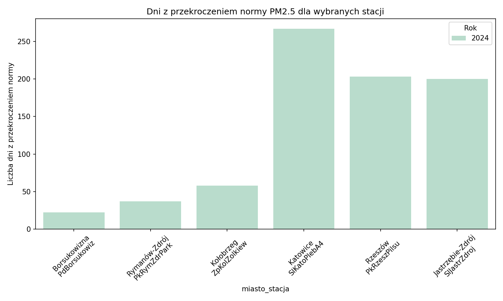
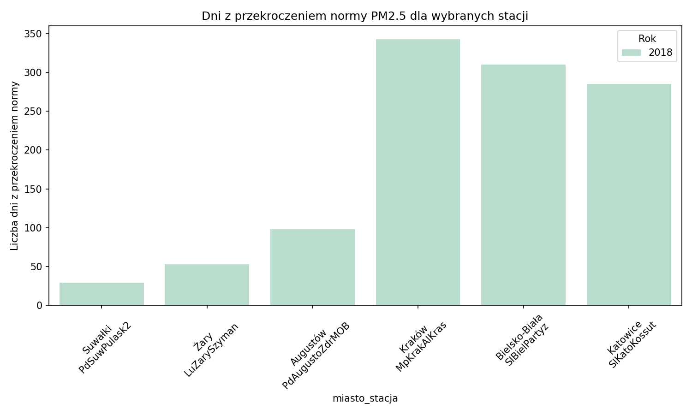
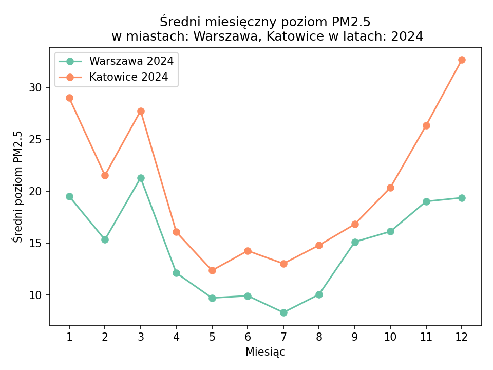
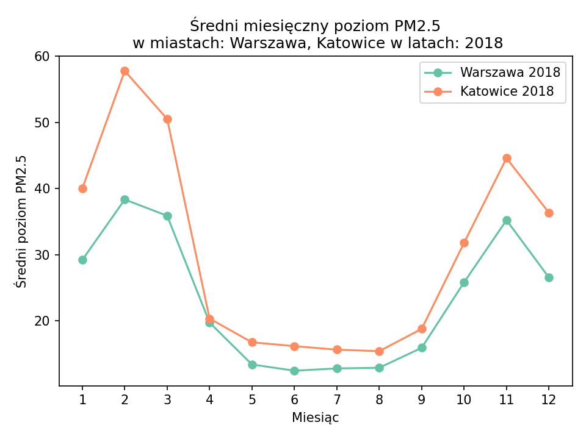
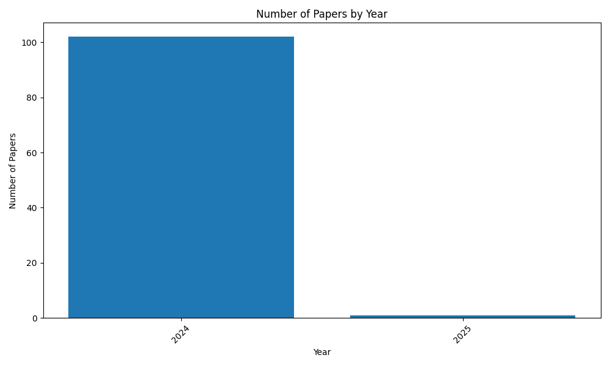
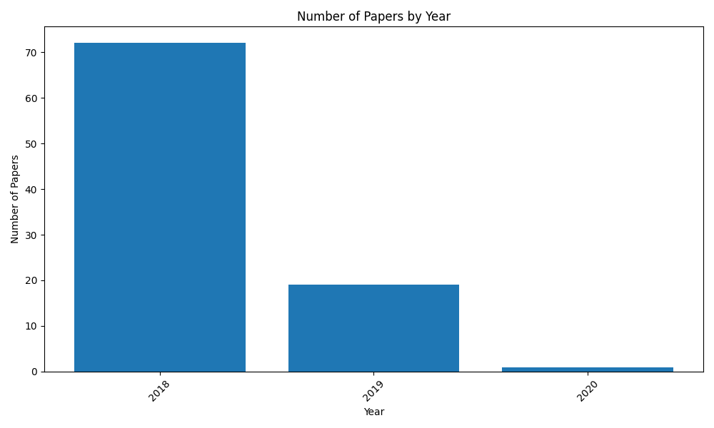
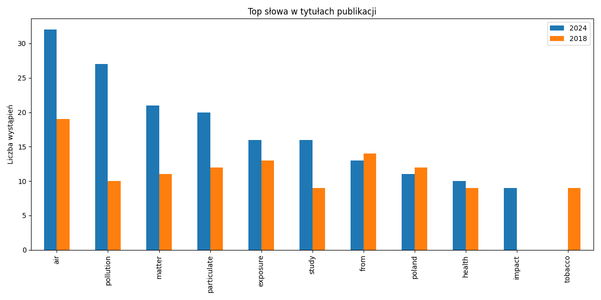

# Task 4 - Raport końcowy

Analiza jakości powietrza (PM2.5) oraz literatury naukowej (PubMed).

**Lata:** 2024, 2018

**Miasta:** Warszawa, Katowice

## PM2.5 - podsumowanie

Tabela przedstawia liczbę dni z przekroczeniem normy PM2.5.

Liczba dni w roku, w których średnie dobowe stężenie PM2.5 przekroczyło obowiązującą normę.

| Miejscowość         |   2024 |   2018 |
|:--------------------|-------:|-------:|
| Augustów            |    156 |     98 |
| Biała               |    127 |    nan |
| Białystok           |    328 |    135 |
| Bielsko-Biała       |    171 |    310 |
| Boguchwała          |    104 |    nan |
| Borsukowizna        |     22 |    nan |
| Bydgoszcz           |    231 |    477 |
| Bytów               |     80 |    nan |
| Chojnów             |    170 |    nan |
| Działdowo           |    160 |    nan |
| Dąbki               |     73 |    nan |
| Dębica              |    185 |    nan |
| Elbląg              |    100 |    nan |
| Ełk                 |    100 |    nan |
| Gdańsk              |    247 |    150 |
| Gdynia              |    143 |    nan |
| Goczałkowice-Zdrój  |    139 |    nan |
| Gorzów Wielkopolski |    115 |    nan |
| Grajewo             |     83 |    nan |
| Jarosław            |    128 |    nan |
| Jastrzębie-Zdrój    |    200 |    nan |
| Jasło               |     89 |    nan |
| Jelenia Góra        |    109 |    198 |
| Kalisz              |    163 |    197 |
| Katowice            |    432 |    285 |
| Konstancin-Jeziorna |    102 |    198 |
| Kołobrzeg           |     58 |    nan |
| Kościan             |    143 |    nan |
| Kościerzyna         |    102 |    143 |
| Kraków              |    330 |    837 |
| Krosno              |     65 |    nan |
| Kudowa-Zdrój        |     98 |    nan |
| Kutno               |    181 |    nan |
| Kędzierzyn-Koźle    |    111 |    281 |
| Kłodzko             |    129 |    nan |
| Legionowo           |    121 |    218 |
| Lublin              |    170 |    234 |
| Lubsko              |     81 |    nan |
| Mielec              |    144 |    241 |
| Nakło nad Notecią   |    136 |    nan |
| Nisko               |    149 |    nan |
| Olsztyn             |    139 |    190 |
| Opole               |    120 |    nan |
| Otwock              |    135 |    201 |
| Piastów             |    124 |    237 |
| Poznań              |    270 |    122 |
| Połaniec            |    150 |    256 |
| Przemyśl            |    146 |    225 |
| Pułtusk             |    130 |    nan |
| Płock               |    131 |    169 |
| Racibórz            |    186 |    nan |
| Radom               |    161 |    250 |
| Radomsko            |    156 |    nan |
| Rymanów-Zdrój       |     37 |    201 |
| Rzeszów             |    396 |    nan |
| Siedlce             |     79 |    205 |
| Skarżysko-Kamienna  |    185 |    nan |
| Sopot               |    123 |    nan |
| Starachowice        |    145 |    nan |
| Strzelce Opolskie   |     92 |    nan |
| Suwałki             |     69 |     29 |
| Szczecin            |    202 |    300 |
| Tarnów              |     97 |    270 |
| Toruń               |    140 |    169 |
| Warszawa            |    807 |    916 |
| Wrocław             |    264 |    428 |
| Wschowa             |     98 |    139 |
| Włocławek           |    182 |    120 |
| Zamość              |    152 |    nan |
| Zgierz              |    189 |    251 |
| Zielona Góra        |    145 |    144 |
| Złoty Potok         |    117 |    192 |
| Łagów               |    131 |    nan |
| Łask                |    157 |    nan |
| Łuków               |    137 |    nan |
| Łódź                |    128 |    454 |
| Świecie             |     92 |    nan |
| Żary                |     83 |     53 |
| Żyrardów            |    142 |    230 |
| Żywiec              |    147 |    nan |
| Kielce              |    nan |    209 |
| Końskie             |    nan |    137 |

Średnie miesięczne wartości PM2.5 (uśrednione po wszystkich stacjach).

**Liczba dni z przekroczeniem normy PM2.5 dla roku 2024 (najwyższe i najniższe wartości):**

**Liczba dni z przekroczeniem normy PM2.5 dla roku 2018 (najwyższe i najniższe wartości):**

### Rok 2024

| ('Miejscowość', 'Kod stacji')   | ('', '')   |   ('Chojnów', 'DsChojnowMalMOB') |   ('Jelenia Góra', 'DsJelGorOgin') |   ('Kłodzko', 'DsKlodzSzkol') |   ('Kudowa-Zdrój', 'DsKudowaSzkoMOB') |   ('Wrocław', 'DsWrocAlWisn') |   ('Wrocław', 'DsWrocWybCon') |   ('Bydgoszcz', 'KpBydPlPozna') |   ('Bydgoszcz', 'KpBydWarszaw') |   ('Nakło nad Notecią', 'KpNaklWawrzy') |   ('Świecie', 'KpSwiecJPawlMOB') |   ('Toruń', 'KpToruKaszow') |   ('Włocławek', 'KpWloclOkrze') |   ('Lublin', 'LbLubObywate') |   ('Łuków', 'LbLukBulNiepMOB') |   ('Zamość', 'LbZamoHrubie') |   ('Kutno', 'LdKutn1Maja7MOB') |   ('Łask', 'LdLaskNarutoMOB') |   ('Łódź', 'LdLodzCzerni') |   ('Radomsko', 'LdRadomsRoln') |   ('Zgierz', 'LdZgieMielcz') |   ('Gorzów Wielkopolski', 'LuGorzKosGdy') |   ('Lubsko', 'LuLubsStrzelMOB ') |   ('Wschowa', 'LuWsKaziWiel') |   ('Żary', 'LuZarySzyman') |   ('Zielona Góra', 'LuZielKrotka') |   ('Kraków', 'MpKrakAlKras') |   ('Kraków', 'MpKrakBulwar') |   ('Tarnów', 'MpTarRoSitko') |   ('Biała', 'MzBialaKmiciMOB') |   ('Konstancin-Jeziorna', 'MzKonJezZero') |   ('Legionowo', 'MzLegZegrzyn') |   ('Otwock', 'MzOtwoBrzozo') |   ('Piastów', 'MzPiasPulask') |   ('Płock', 'MzPlocMiReja') |   ('Pułtusk', 'MzPultuskMicMOB') |   ('Radom', 'MzRadTochter') |   ('Siedlce', 'MzSiedKonars') |   ('Warszawa', 'MzWarAlNiepo') |   ('Warszawa', 'MzWarBajkowa') |   ('Warszawa', 'MzWarChrosci') |   ('Warszawa', 'MzWarKondrat') |   ('Warszawa', 'MzWarTolstoj') |   ('Warszawa', 'MzWarWokalna') |   ('Żyrardów', 'MzZyraRoosev') |   ('Kędzierzyn-Koźle', 'OpKKozBSmial') |   ('Opole', 'OpOpoleKoszy') |   ('Strzelce Opolskie', 'OpStrzOpWyszMOB') |   ('Augustów', 'PdAugustowUz') |   ('Białystok', 'PdBialAlPils') |   ('Białystok', 'PdBialPPiech') |   ('Białystok', 'PdBialUpalna') |   ('Borsukowizna', 'PdBorsukowiz') |   ('Grajewo', 'PdGrajewoWPoMOB') |   ('Suwałki', 'PdSuwPulask2') |   ('Boguchwała', 'PkBoguchAngeMOB') |   ('Dębica', 'PkDebiGrottg') |   ('Jarosław', 'PkJarosPruch') |   ('Jasło', 'PkJasloSikor') |   ('Krosno', 'PkKrosKletow') |   ('Mielec', 'PkMielBierna') |   ('Nisko', 'PkNiskoSzkla') |   ('Przemyśl', 'PkPrzemGrunw') |   ('Rymanów-Zdrój', 'PkRymZdrPark') |   ('Rzeszów', 'PkRzeszPilsu') |   ('Rzeszów', 'PkRzeszSloci') |   ('Rzeszów', 'PkRzeszStarz') |   ('Bytów', 'PmBytowMila1MOB') |   ('Gdańsk', 'PmGdaLeczkow') |   ('Gdańsk', 'PmGdaWyzwole') |   ('Gdynia', 'PmGdyPorebsk') |   ('Kościerzyna', 'PmKosTargowa') |   ('Sopot', 'PmSopBiPlowc') |   ('Łagów', 'SkLagowZaploMOB') |   ('Połaniec', 'SkPolaRuszcz') |   ('Skarżysko-Kamienna', 'SkSkarz1MajaMOB') |   ('Starachowice', 'SkStaraZlota') |   ('Bielsko-Biała', 'SlBielPartyz') |   ('Goczałkowice-Zdrój', 'SlGoczaUzdroMOB') |   ('Jastrzębie-Zdrój', 'SlJastrZdroj') |   ('Katowice', 'SlKatoKossut') |   ('Katowice', 'SlKatoPlebA4') |   ('Racibórz', 'SlRaciborzWPMOB') |   ('Złoty Potok', 'SlZlotPotLes') |   ('Żywiec', 'SlZywieKoper') |   ('Działdowo', 'WmDzialPolnaMOB') |   ('Elbląg', 'WmElbBazynsk') |   ('Ełk', 'WmElkStadion') |   ('Olsztyn', 'WmOlsPuszkin') |   ('Kalisz', 'WpKaliSawick') |   ('Kościan', 'WpKoscianMayMOB') |   ('Poznań', 'WpPoznDabrow') |   ('Poznań', 'WpPoznSzwajc') |   ('Dąbki', 'ZpDabkiSztorMOB') |   ('Kołobrzeg', 'ZpKolZolkiew') |   ('Szczecin', 'ZpSzczAndrze') |   ('Szczecin', 'ZpSzczPilsud') |
|:--------------------------------|:-----------|---------------------------------:|-----------------------------------:|------------------------------:|--------------------------------------:|------------------------------:|------------------------------:|--------------------------------:|--------------------------------:|----------------------------------------:|---------------------------------:|----------------------------:|--------------------------------:|-----------------------------:|-------------------------------:|-----------------------------:|-------------------------------:|------------------------------:|---------------------------:|-------------------------------:|-----------------------------:|------------------------------------------:|---------------------------------:|------------------------------:|---------------------------:|-----------------------------------:|-----------------------------:|-----------------------------:|-----------------------------:|-------------------------------:|------------------------------------------:|--------------------------------:|-----------------------------:|------------------------------:|----------------------------:|---------------------------------:|----------------------------:|------------------------------:|-------------------------------:|-------------------------------:|-------------------------------:|-------------------------------:|-------------------------------:|-------------------------------:|-------------------------------:|---------------------------------------:|----------------------------:|-------------------------------------------:|-------------------------------:|--------------------------------:|--------------------------------:|--------------------------------:|-----------------------------------:|---------------------------------:|------------------------------:|------------------------------------:|-----------------------------:|-------------------------------:|----------------------------:|-----------------------------:|-----------------------------:|----------------------------:|-------------------------------:|------------------------------------:|------------------------------:|------------------------------:|------------------------------:|-------------------------------:|-----------------------------:|-----------------------------:|-----------------------------:|----------------------------------:|----------------------------:|-------------------------------:|-------------------------------:|--------------------------------------------:|-----------------------------------:|------------------------------------:|--------------------------------------------:|---------------------------------------:|-------------------------------:|-------------------------------:|----------------------------------:|----------------------------------:|-----------------------------:|-----------------------------------:|-----------------------------:|--------------------------:|------------------------------:|-----------------------------:|---------------------------------:|-----------------------------:|-----------------------------:|-------------------------------:|--------------------------------:|-------------------------------:|-------------------------------:|
| rok                             | miesiąc    |                         nan      |                          nan       |                     nan       |                             nan       |                     nan       |                     nan       |                       nan       |                       nan       |                               nan       |                        nan       |                    nan      |                       nan       |                     nan      |                      nan       |                     nan      |                       nan      |                     nan       |                  nan       |                       nan      |                    nan       |                                 nan       |                        nan       |                     nan       |                  nan       |                           nan      |                     nan      |                     nan      |                    nan       |                      nan       |                                 nan       |                       nan       |                    nan       |                     nan       |                   nan       |                        nan       |                    nan      |                     nan       |                      nan       |                      nan       |                      nan       |                      nan       |                      nan       |                      nan       |                      nan       |                              nan       |                   nan       |                                  nan       |                      nan       |                       nan       |                       nan       |                       nan       |                          nan       |                        nan       |                     nan       |                            nan      |                    nan       |                      nan       |                   nan       |                    nan       |                    nan       |                   nan       |                       nan      |                           nan       |                      nan      |                     nan       |                     nan       |                      nan       |                     nan      |                    nan       |                    nan       |                         nan       |                   nan       |                      nan       |                      nan       |                                   nan       |                          nan       |                            nan      |                                   nan       |                               nan      |                      nan       |                       nan      |                          nan      |                         nan       |                    nan       |                          nan       |                    nan       |                 nan       |                     nan       |                     nan      |                        nan       |                    nan       |                    nan       |                      nan       |                       nan       |                      nan       |                       nan      |
| 2024                            | 1          |                          25.4516 |                           23.2749  |                      32.6199  |                              21.9487  |                      24.5965  |                      20.2469  |                        17.4656  |                        19.8929  |                                23.5781  |                         16.7723  |                     19.0935 |                        26.9563  |                      22.482  |                       22.5851  |                      22.2335 |                        25.4127 |                      27.5778  |                   19.6516  |                        27.9231 |                     34.6381  |                                  20.136   |                         26.6852  |                      16.9242  |                   14.3263  |                            13.487  |                      25.0583 |                      26.5282 |                     22.2764  |                       18.4539  |                                  16.8288  |                        20.1673  |                     21.7801  |                      20.5221  |                    18.1285  |                         19.2853  |                     21.6237 |                      22.7035  |                       20.9673  |                       20.0215  |                       16.8185  |                       17.7696  |                       23.9531  |                       17.3824  |                       20.3571  |                               26.153   |                    37.8392  |                                   23.3843  |                       28.3946  |                        20.2258  |                        18.0588  |                        15.414   |                            9.04315 |                         16.0583  |                      13.1716  |                             12.9112 |                     30.4014  |                       25.4531  |                    19.1536  |                     19.795   |                     33.0868  |                    23.1707  |                        22.5017 |                            12.6895  |                       27.5085 |                      22.9139  |                      24.9137  |                       11.003   |                      16.5505 |                     13.2247  |                     15.8063  |                          20.0513  |                    14.3207  |                       22.9707  |                       29.5531  |                                    35.5839  |                           27.5896  |                             27.3048 |                                    30.4719  |                                28.9098 |                       25.7196  |                        32.2109 |                           28.4601 |                          17.1175  |                     27.9785  |                           34.1356  |                     15.7914  |                  14.0454  |                      18.5094  |                      24.5074 |                         30.3873  |                     27.042   |                     17.9546  |                       10.816   |                        10.7608  |                       11.5047  |                        14.529  |
| 2024                            | 2          |                          23.7279 |                           13.5062  |                      18.7997  |                              15.554   |                      16.5534  |                      14.0305  |                        14.6891  |                        16.0904  |                                19.7295  |                         13.1013  |                     14.9408 |                        23.6046  |                      17.857  |                       17.3122  |                      18.4921 |                        20.6878 |                      18.6412  |                   15.9209  |                        17.0588 |                     23.8985  |                                  13.8403  |                         12.4401  |                      14.5322  |                    8.41962 |                            13.3684 |                      21.9588 |                      19.7957 |                     16.0911  |                       16.7835  |                                  13.6023  |                        16.9144  |                     15.6509  |                      15.9611  |                    15.8905  |                         16.2536  |                     18.3503 |                      17.7358  |                       16.0032  |                       15.1777  |                       13.0158  |                       14.8208  |                       19.118   |                       13.6647  |                       17.7533  |                               13.5362  |                    24.424   |                                   12.3158  |                       17.2376  |                        15.9925  |                        12.3441  |                        11.0073  |                            5.52478 |                         12.0522  |                      12.3931  |                             16.8909 |                     19.8556  |                       19.3161  |                    11.8281  |                      9.44075 |                     18.4154  |                    19.0414  |                        20.9503 |                             9.94158 |                       21.9628 |                      16.1931  |                      16.0368  |                       10.0601  |                      15.185  |                     12.193   |                     16.8651  |                          14.0322  |                    13.1809  |                       20.0147  |                       18.8254  |                                    24.8291  |                           18.071   |                             18.8996 |                                    18.8092  |                                20.3677 |                       18.9108  |                        24.0866 |                           19.5124 |                          13.3023  |                     24.0871  |                           25.005   |                     14.1957  |                  15.071   |                      16.1422  |                      18.6193 |                         20.7402  |                     25.0671  |                     13.2599  |                       10.3272  |                        10.5156  |                        9.03511 |                        13.5395 |
| 2024                            | 3          |                          29.2716 |                           19.9343  |                      24.0953  |                              17.7692  |                      24.2412  |                      21.0382  |                        23.0968  |                        23.3586  |                                26.6121  |                         18.5608  |                     22.3655 |                        32.8751  |                      25.7542 |                       24.0804  |                      24.451  |                        28.6757 |                      29.8039  |                   21.4355  |                        25.7298 |                     29.8923  |                                  28.5655  |                         20.1435  |                      23.1085  |                   25.1872  |                            27.6891 |                      27.7129 |                      25.8497 |                     18.4929  |                       23.1607  |                                  19.2682  |                        22.5763  |                     21.7605  |                      21.605   |                    22.5191  |                         22.2454  |                     23.9499 |                      26.5257  |                       22.2751  |                       21.3078  |                       17.9144  |                       20.9072  |                       26.5065  |                       18.6942  |                       25.4715  |                               20.0681  |                    22.6941  |                                   19.2798  |                       21.0237  |                        22.9456  |                        17.1942  |                        17.3069  |                           10.1135  |                         18.3041  |                      14.6264  |                             17.9737 |                     26.0964  |                       22.304   |                    13.8135  |                     11.9272  |                     23.9526  |                    21.7669  |                        23.7296 |                            11.8117  |                       27.5958 |                      20.1376  |                      21.1824  |                       18.2038  |                      22.5792 |                     17.9399  |                     23.0823  |                          21.4059  |                    20.2922  |                       22.6942  |                       24.1704  |                                    29.5942  |                           25.333   |                             27.1272 |                                    24.7492  |                                26.7746 |                       24.6512  |                        30.7968 |                           25.9141 |                          20.7783  |                     28.3537  |                           29.7397  |                     19.011   |                  18.6106  |                      21.3894  |                      28.0211 |                         29.462   |                     29.8078  |                     24.2113  |                       22.6563  |                        17.8636  |                       25.6095  |                        28.6413 |
| 2024                            | 4          |                          14.8887 |                            9.88653 |                      11.3263  |                               8.65174 |                      11.8944  |                       9.80362 |                        11.3108  |                        10.4337  |                                12.081   |                          9.22194 |                     13.8165 |                        15.9372  |                      14.3338 |                       14.8333  |                      13.8503 |                        15.2897 |                      14.1622  |                    9.44134 |                        13.5004 |                     14.0854  |                                   9.84833 |                          7.77264 |                       9.71306 |                   11.4126  |                            14.0256 |                      15.3679 |                      14.0074 |                     10.361   |                       11.7262  |                                  10.3185  |                        11.688   |                     11.9103  |                      11.8844  |                    11.1593  |                         11.6721  |                     14.0715 |                      13.6606  |                       13.7794  |                       12.2197  |                       10.2617  |                       11.4135  |                       14.5525  |                       10.3706  |                       11.6457  |                                9.39847 |                     8.44056 |                                    8.41769 |                       12.0061  |                        13.3363  |                        10.2671  |                        10.525   |                            4.99066 |                         11.4503  |                       9.11736 |                             13.7699 |                     12.5689  |                       12.4528  |                     7.97365 |                      7.49298 |                     13.2454  |                    11.5744  |                        13.0232 |                             7.70486 |                       16.6899 |                      11.9478  |                      11.2686  |                       12.759   |                      15.1312 |                     14.5127  |                     15.5108  |                          15.7124  |                    13.55    |                       11.9729  |                       13.7672  |                                    14.6221  |                           12.3181  |                             16.2617 |                                    12.3191  |                                15.6092 |                       13.3983  |                        18.6868 |                           14.5327 |                          11.42    |                     13.5699  |                           13.6549  |                      9.92667 |                  10.5508  |                      12.7896  |                      13.4712 |                         11.8031  |                     13.5127  |                     12.3719  |                       10.8456  |                         7.54042 |                        9.18092 |                        13.8844 |
| 2024                            | 5          |                          11.883  |                            8.23468 |                       7.95148 |                               7.2397  |                      11.0413  |                       9.18427 |                        10.8731  |                         9.57363 |                                 9.92016 |                          9.99637 |                     12.9225 |                        13.1158  |                      10.4833 |                       11.2368  |                      10.1535 |                        12.897  |                      11.2368  |                   10.5571  |                        11.0292 |                      8.74166 |                                  10.4109  |                          7.06788 |                       7.54637 |                   12.6676  |                            18.8923 |                      13.2499 |                      10.7712 |                      7.64987 |                       11.6471  |                                   8.28683 |                         9.50349 |                      9.96734 |                       9.08185 |                     9.85269 |                          9.77634 |                     11.1777 |                       9.88477 |                       11.3663  |                        9.85161 |                        7.82661 |                        9.49583 |                       11.6324  |                        7.9796  |                        9.66959 |                                8.02853 |                     7.34583 |                                    7.47881 |                       11.828   |                        11.6391  |                         9.68062 |                        10.6102  |                            5.28733 |                         10.1813  |                       8.96783 |                             10.8367 |                      8.29922 |                        8.46532 |                     5.31465 |                      5.00517 |                     10.2329  |                     9.26977 |                        10.6687 |                             5.61344 |                       13.2892 |                       8.78538 |                       8.55718 |                       11.9364  |                      14.4505 |                     13.3292  |                     13.6883  |                          11.3482  |                    13.1527  |                        9.69852 |                       10.1008  |                                     9.43965 |                           10.3221  |                             12.6009 |                                     9.26833 |                                12.8184 |                        9.58881 |                        15.0894 |                           12.1691 |                           8.57823 |                      9.23965 |                            8.88078 |                      7.50417 |                   9.21252 |                      12.6699  |                      12.6827 |                          9.27056 |                     11.5448  |                     11.5852  |                       12.2759  |                         9.6475  |                        9.60941 |                        14.0055 |
| 2024                            | 6          |                          12.5518 |                            9.51333 |                       8.05361 |                               9.96405 |                      10.5095  |                       9.42962 |                         8.96173 |                         9.07472 |                                 8.87028 |                          9.39917 |                     11.8771 |                        10.0503  |                      11.3768 |                       11.6169  |                      10.2263 |                        12.1154 |                      10.541   |                    9.70417 |                        11.7891 |                      9.0098  |                                   9.69025 |                          7.56542 |                      11.1445  |                    8.61558 |                            15.5206 |                      12.5538 |                      11.8001 |                      7.97389 |                       10.4275  |                                   8.6602  |                         9.11569 |                      9.75833 |                       9.37097 |                     9.62857 |                          8.98122 |                     11.4886 |                      13.7196  |                       11.5047  |                       10.0637  |                        7.73014 |                        9.53396 |                       12.1393  |                        8.42409 |                        9.1681  |                                8.28875 |                     4.95444 |                                    8.54826 |                       10.7706  |                        11.0078  |                         8.59278 |                        10.5075  |                            5.33592 |                          8.92024 |                       6.94069 |                             10.8625 |                     12.0025  |                        7.24729 |                     7.76196 |                      5.50029 |                      9.98775 |                    11.1215  |                        10.9249 |                             6.93853 |                       11.8548 |                       8.17159 |                       7.43226 |                       10.3309  |                      12.3352 |                     10.8472  |                     12.3887  |                           9.83519 |                    11.5657  |                        9.55258 |                        9.14268 |                                     9.0025  |                            9.56252 |                             11.5181 |                                     9.10813 |                                12.9759 |                       11.9018  |                        16.5735 |                           12.2489 |                           9.74    |                      8.46    |                            7.67861 |                      9.34    |                   8.13681 |                      11.3559  |                      12.2783 |                          9.26299 |                     10.2482  |                     11.0667  |                       10.7165  |                         8.20986 |                        9.19108 |                        12.5201 |
| 2024                            | 7          |                          11.0288 |                            7.45376 |                       6.47809 |                               8.74058 |                       9.09769 |                       8.48293 |                         7.75873 |                         7.72291 |                                 7.83171 |                          7.42164 |                     10.1326 |                         7.90739 |                      10.4484 |                        9.10769 |                      10.1343 |                        10.565  |                       9.06051 |                    7.75868 |                        12.5681 |                      8.68374 |                                   7.99282 |                          5.58037 |                       6.29048 |                    7.8121  |                            10.8836 |                      12.3677 |                      11.4976 |                      9.95118 |                        8.37372 |                                   6.79179 |                         8.07712 |                      8.61391 |                       8.03883 |                     7.9004  |                          8.2078  |                     10.1758 |                     nan       |                        9.94468 |                        8.31371 |                        6.99295 |                        7.96482 |                        9.47994 |                        7.0628  |                        7.4289  |                                7.62361 |                     2.84207 |                                    7.27339 |                        8.17137 |                         8.41089 |                         7.62943 |                         8.05241 |                            4.16713 |                          6.75775 |                       7.80162 |                             11.4092 |                     12.1044  |                        8.18481 |                     8.73507 |                      6.98694 |                     10.1086  |                    11.2035  |                        11.5467 |                             7.93607 |                       12.0659 |                       8.54422 |                       7.91089 |                        8.30968 |                       9.7638 |                      7.51023 |                      9.75156 |                           7.43562 |                     9.02853 |                        8.53486 |                        9.75849 |                                     8.17984 |                            6.97156 |                             11.3007 |                                     9.03049 |                                12.3597 |                       10.4968  |                        15.4997 |                           11.1264 |                           8.80499 |                      8.37228 |                            6.24073 |                      8.28401 |                   6.36989 |                       9.50625 |                      10.2617 |                          7.2336  |                      8.11586 |                      9.35941 |                        8.77554 |                         6.2047  |                        6.9332  |                        10.7047 |
| 2024                            | 8          |                          13.2153 |                            9.37258 |                       7.82022 |                               9.9526  |                      11.5741  |                      13.2866  |                         9.20973 |                         9.17977 |                                 9.63257 |                          8.18387 |                     11.7952 |                         8.56986 |                      12.9167 |                       10.3567  |                      12.2433 |                        12.2407 |                      10.7172  |                    9.85148 |                        14.2524 |                     10.9326  |                                   9.44046 |                          7.33763 |                       7.2043  |                    9.84669 |                            13.2757 |                      12.7316 |                      12.9187 |                      7.89597 |                        9.65299 |                                   8.19315 |                         9.00538 |                      9.8     |                       9.39059 |                    10.7829  |                          9.41184 |                     11.9172 |                     nan       |                       11.6241  |                        9.59771 |                        9.00578 |                        9.51696 |                       11.8922  |                        8.5429  |                        9.49341 |                                9.26294 |                     6.91359 |                                    9.12867 |                       10.3367  |                        10.593   |                         9.42881 |                        10.8222  |                            5.55559 |                          8.77473 |                      10.1377  |                             12.686  |                     14.2651  |                        9.8581  |                     8.9984  |                      7.25302 |                     12.8191  |                    12.873   |                        12.9716 |                             8.35855 |                       13.2795 |                       9.39146 |                       9.31599 |                        9.90524 |                      11.6289 |                      9.13351 |                     11.4814  |                           8.20806 |                    10.9929  |                       10.2265  |                       12.1759  |                                    11.3054  |                            8.21655 |                             13.0733 |                                    10.4049  |                                14.0931 |                       11.9488  |                        17.597  |                           12.6337 |                          11.3386  |                     10.6489  |                            6.4039  |                      9.73414 |                   7.83215 |                      11.9468  |                      12.8734 |                          9.22204 |                     10.0364  |                     11.2039  |                       10.6836  |                         7.35766 |                        8.80336 |                        12.7719 |
| 2024                            | 9          |                          16.094  |                           11.4912  |                      11.0954  |                               8.09581 |                      13.1146  |                      15.8568  |                        12.9134  |                        13.9175  |                                14.4414  |                          9.15736 |                     16.9958 |                        16.52    |                      18.2249 |                       14.018   |                      16.9855 |                        16.6493 |                      15.6069  |                   13.9848  |                        15.2079 |                     14.9731  |                                  14.2176  |                         10.3607  |                      10.0399  |                   13.3545  |                            19.2498 |                      15.2784 |                      14.6658 |                     11.5925  |                       13.8722  |                                  12.7091  |                        13.6842  |                     13.4114  |                      13.6888  |                    14.3353  |                         15.0188  |                     15.6537 |                     nan       |                       16.26    |                       14.5182  |                       12.9922  |                       15.1552  |                       18.8215  |                       12.798   |                       14.3922  |                               12.1874  |                     9.14826 |                                   11.0207  |                       16.7154  |                        17.3519  |                        14.1797  |                        13.6412  |                           10.4681  |                         14.2948  |                      14.674   |                             14.5374 |                     16.5874  |                       13.8848  |                    11.8803  |                      8.33721 |                     16.4772  |                    13.9189  |                        15.6556 |                             9.9725  |                       17.2805 |                      12.4024  |                      12.2742  |                       13.4806  |                      16.0223 |                     12.4796  |                     15.3129  |                          11.4799  |                    14.8495  |                       14.4446  |                       17.7441  |                                    15.2612  |                           16.3108  |                             14.316  |                                    12.3619  |                                16.1936 |                       13.9561  |                        19.6356 |                           15.1724 |                          13.5463  |                     11.3447  |                           11.8303  |                     14.2008  |                  13.5014  |                      15.6394  |                      17.3578 |                         14.1676  |                     14.2434  |                     12.2179  |                       14.2223  |                        11.2759  |                       14.0486  |                        16.8761 |
| 2024                            | 10         |                          22.8555 |                           13.6779  |                      16.5508  |                              15.1152  |                      15.1256  |                      17.4688  |                        13.1042  |                        17.4666  |                                17.5513  |                         12.6244  |                     13.7329 |                        20.9359  |                      21.4822 |                       15.5001  |                      17.4435 |                        20.158  |                      17.8281  |                   16.0398  |                        17.3136 |                     22.5424  |                                  14.4727  |                         12.2647  |                      12.5331  |                   11.5933  |                            16.2647 |                      17.136  |                      16.7254 |                     11.1702  |                       14.8459  |                                  13.7573  |                        16.3393  |                     17.689   |                      15.1522  |                    14.9561  |                         16.4256  |                     17.6135 |                     nan       |                       16.5533  |                       16.8886  |                       14.5805  |                       14.5987  |                       19.5043  |                       14.4747  |                       16.4741  |                               12.9953  |                    12.9074  |                                   13.262   |                       16.9681  |                        16.102   |                        13.2973  |                        12.5821  |                            5.62476 |                         12.3692  |                      10.751   |                             16.4237 |                     20.8834  |                       15.5863  |                    14.1084  |                     10.3806  |                     19.1785  |                    18.6876  |                        17.3013 |                             8.68602 |                       18.2788 |                      14.1272  |                      10.2439  |                        9.82567 |                      14.0748 |                     11.7333  |                     13.9366  |                          13.4578  |                    12.366   |                       15.4271  |                       18.6303  |                                    23.1908  |                           17.397   |                             20.7559 |                                    21.4278  |                                22.6387 |                       16.7992  |                        23.8598 |                           20.7664 |                          13.9397  |                     20.9011  |                           20.525   |                     13.7173  |                  12.5165  |                      14.7912  |                      19.584  |                         19.2405  |                     15.756   |                     14.9989  |                       11.9069  |                        10.3029  |                        9.92221 |                        16.2226 |
| 2024                            | 11         |                          23.3171 |                           20.9625  |                      25.4609  |                              19.9783  |                      20.1026  |                      21.7343  |                        14.3324  |                        20.2146  |                                19.9624  |                         21.174   |                     16.4422 |                        23.2387  |                      24.9449 |                       19.1156  |                      21.8021 |                        23.8379 |                      24.4771  |                   20.0723  |                        21.9649 |                     33.8663  |                                  16.1936  |                         15.739   |                      16.6189  |                   13.4761  |                            15.2782 |                      22.1239 |                      20.8987 |                     14.9341  |                       16.7268  |                                  16.0472  |                        17.6353  |                     22.7177  |                      17.1265  |                    18.1263  |                         20.1971  |                     22.8475 |                     nan       |                       19.5025  |                       21.3381  |                       18.0509  |                       16.2936  |                       22.8711  |                       15.9205  |                       19.611   |                               19.2449  |                    20.0758  |                                   17.7499  |                       23.0089  |                        17.9031  |                        16.0792  |                        14.2399  |                            7.62583 |                         14.6234  |                      10.1028  |                             19.4253 |                     30.0471  |                       22.2858  |                    18.2997  |                     18.7045  |                     22.6355  |                    22.9476  |                        20.3485 |                            12.6199  |                       23.2066 |                      19.7983  |                      10.8033  |                        9.36208 |                      13.7436 |                     11.4685  |                     14.1634  |                          13.7101  |                    12.432   |                       16.1113  |                       24.7941  |                                    27.374   |                           20.9255  |                             26.6063 |                                    22.2194  |                                25.3215 |                       22.5381  |                        30.0964 |                           23.2944 |                          18.4647  |                     26.2107  |                           26.7668  |                     15.7793  |                  12.8294  |                      16.3028  |                      21.4651 |                         23.3929  |                     18.1391  |                     18.5984  |                        9.43528 |                         8.91799 |                        9.60847 |                        12.2732 |
| 2024                            | 12         |                          31.6973 |                           24.603   |                      32.3153  |                              17.2515  |                      24.5864  |                      26.7775  |                        12.4876  |                        20.1098  |                                19.4553  |                         16.1502  |                     18.4353 |                        24.0247  |                      23.5742 |                       18.0392  |                      19.2774 |                        24.7789 |                      28.9047  |                   21.6657  |                        23.3431 |                     36.1126  |                                  14.1309  |                         11.8676  |                      17.5712  |                   13.6556  |                            12.6732 |                      26.4993 |                      23.1968 |                     18.1506  |                       17.7952  |                                  16.5514  |                        19.2143  |                     25.8194  |                      17.2227  |                    18.0878  |                         19.2088  |                     24.6613 |                     nan       |                       18.5647  |                       22.9931  |                       18.5704  |                       16.3121  |                       23.5497  |                       16.0695  |                       21.6737  |                               27.5866  |                    35.9262  |                                   27.7171  |                       22.7038  |                        17.0112  |                        16.0648  |                        13.631   |                            7.47517 |                         17.9084  |                      11.8746  |                             12.7053 |                     29.088   |                       19.7856  |                    18.6659  |                     14.3843  |                     20.7563  |                    23.7783  |                        23.3879 |                            12.0376  |                       32.0248 |                      20.3372  |                      10.4199  |                       11.0075  |                      13.8681 |                     10.1103  |                     14.8737  |                          13.1555  |                    12.6081  |                       19.4512  |                       27.5403  |                                    33.5919  |                           25.9509  |                             34.0489 |                                    31.9173  |                                34.1031 |                       30.3129  |                        34.9669 |                           31.7555 |                          20.4048  |                     35.1278  |                           26.7781  |                     16.2843  |                  13.9026  |                      16.7159  |                      27.3538 |                         21.9951  |                     17.7637  |                     19.6435  |                       12.3387  |                        11.4378  |                        9.29986 |                        12.5433 |

**Trend średnich miesięcznych:**

### Rok 2018

| ('Miejscowość', 'Kod stacji')   | ('', '')   |   ('Jelenia Góra', 'DsJelGorOgin') |   ('Wrocław', 'DsWrocAlWisn') |   ('Wrocław', 'DsWrocWybCon') |   ('Bydgoszcz', 'KpBydPlPozna') |   ('Bydgoszcz', 'KpBydWarszaw') |   ('Toruń', 'KpToruDziewu') |   ('Włocławek', 'KpWloclOkrze') |   ('Lublin', 'LbLubObywate') |   ('Łódź', 'LdLodzCzerni') |   ('Łódź', 'LdLodzGdansk') |   ('Zgierz', 'LdZgieMielcz') |   ('Wschowa', 'LuWsKaziWiel') |   ('Żary', 'LuZarySzyman') |   ('Zielona Góra', 'LuZielKrotka') |   ('Kraków', 'MpKrakAlKras') |   ('Kraków', 'MpKrakBujaka') |   ('Kraków', 'MpKrakBulwar') |   ('Tarnów', 'MpTarRoSitko') |   ('Konstancin-Jeziorna', 'MzKonJezWieMOB') |   ('Legionowo', 'MzLegZegrzyn') |   ('Otwock', 'MzOtwoBrzozo') |   ('Piastów', 'MzPiasPulask') |   ('Płock', 'MzPlocMiReja') |   ('Radom', 'MzRadTochter') |   ('Siedlce', 'MzSiedKonars') |   ('Warszawa', 'MzWarAlNiepo') |   ('Warszawa', 'MzWarKondrat') |   ('Warszawa', 'MzWarTolstoj') |   ('Warszawa', 'MzWarWokalna') |   ('Żyrardów', 'MzZyraRoosev') |   ('Kędzierzyn-Koźle', 'OpKKozBSmial') |   ('Augustów', 'PdAugustoZdrMOB') |   ('Białystok', 'PdBialUpalna') |   ('Suwałki', 'PdSuwPulask2') |   ('Mielec', 'PkMielBierna') |   ('Przemyśl', 'PkPrzemGrunw') |   ('Rymanów-Zdrój', 'PkRymZdrPark') |   ('Gdańsk', 'PmGdaLeczkow') |   ('Kościerzyna', 'PmKosTargowa') |   ('Kielce', 'SkKielJagiel') |   ('Kielce', 'SkKielTargow') |   ('Końskie', 'SkKonsGranatMOB') |   ('Połaniec', 'SkPolaRuszcz') |   ('Bielsko-Biała', 'SlBielPartyz') |   ('Katowice', 'SlKatoKossut') |   ('Złoty Potok', 'SlZlotPotLes') |   ('Olsztyn', 'WmOlsPuszkin') |   ('Kalisz', 'WpKaliSawick') |   ('Poznań', 'WpPoznDabrow') |   ('Szczecin', 'ZpSzczAndrze') |   ('Szczecin', 'ZpSzczPilsud') |
|:--------------------------------|:-----------|-----------------------------------:|------------------------------:|------------------------------:|--------------------------------:|--------------------------------:|----------------------------:|--------------------------------:|-----------------------------:|---------------------------:|---------------------------:|-----------------------------:|------------------------------:|---------------------------:|-----------------------------------:|-----------------------------:|-----------------------------:|-----------------------------:|-----------------------------:|--------------------------------------------:|--------------------------------:|-----------------------------:|------------------------------:|----------------------------:|----------------------------:|------------------------------:|-------------------------------:|-------------------------------:|-------------------------------:|-------------------------------:|-------------------------------:|---------------------------------------:|----------------------------------:|--------------------------------:|------------------------------:|-----------------------------:|-------------------------------:|------------------------------------:|-----------------------------:|----------------------------------:|-----------------------------:|-----------------------------:|---------------------------------:|-------------------------------:|------------------------------------:|-------------------------------:|----------------------------------:|------------------------------:|-----------------------------:|-----------------------------:|-------------------------------:|-------------------------------:|
| rok                             | miesiąc    |                           nan      |                      nan      |                      nan      |                        nan      |                        nan      |                   nan       |                        nan      |                     nan      |                   nan      |                   nan      |                     nan      |                      nan      |                   nan      |                          nan       |                     nan      |                     nan      |                     nan      |                     nan      |                                    nan      |                        nan      |                    nan       |                      nan      |                   nan       |                    nan      |                      nan      |                       nan      |                       nan      |                       nan      |                       nan      |                       nan      |                               nan      |                         nan       |                       nan       |                      nan      |                     nan      |                       nan      |                            nan      |                     nan      |                          nan      |                     nan      |                     nan      |                         nan      |                       nan      |                            nan      |                       nan      |                          nan      |                     nan       |                     nan      |                     nan      |                      nan       |                       nan      |
| 2018                            | 1          |                            21.1214 |                       25.5988 |                       25.8107 |                         35.0052 |                         38.3507 |                    28.7679  |                        nan      |                      28.667  |                    24.395  |                    33.9852 |                      41.0109 |                      nan      |                   nan      |                           21.2576  |                      49.7144 |                      41.9806 |                      48.6454 |                      26.6691 |                                     27.7857 |                         33.2381 |                     38.7439  |                       32.0169 |                    28.0067  |                     33.7462 |                       31.4503 |                        33.246  |                        30.3476 |                        24.9937 |                        28.3113 |                        38.1342 |                                31.0911 |                          15.4489  |                        22.5976  |                      nan      |                      30.3164 |                        27.1993 |                             23.7594 |                      17.621  |                           32.2356 |                      28.3801 |                     nan      |                         nan      |                        27.5345 |                             48.2889 |                        40.0341 |                           27.328  |                      25.4296  |                     nan      |                     nan      |                       23.0705  |                        21.1823 |
| 2018                            | 2          |                            38.0703 |                       45.7107 |                       46.2281 |                         51.5066 |                         48.1451 |                    41.4388  |                        nan      |                      33.3604 |                    37.9226 |                    46.6595 |                      62.3774 |                      nan      |                   nan      |                           36.3268  |                      58.2665 |                      53.5606 |                      47.1144 |                      45.0043 |                                     38.0504 |                         48.0072 |                     60.0634  |                       41.7554 |                    41.3726  |                     39.3954 |                       40.8782 |                        41.0822 |                        39.4452 |                        38.9418 |                        33.9793 |                        51.1024 |                                54.3597 |                          19.4695  |                        29.9433  |                      nan      |                      51.7294 |                        34.7523 |                             35.1619 |                      22.1674 |                           53.4957 |                      43.4151 |                     nan      |                         nan      |                        41.8186 |                             79.2586 |                        57.8066 |                           37.6867 |                      27.6044  |                      49.7546 |                     nan      |                       27.8509  |                        30.2669 |
| 2018                            | 3          |                            35.9978 |                       38.4563 |                       37.2148 |                         45.0662 |                         56.718  |                    40.7931  |                        nan      |                      37.5593 |                    33.2096 |                    38.915  |                      52.1621 |                      nan      |                   nan      |                           28.0303  |                      57.7579 |                      49.9193 |                      45.7848 |                      43.1079 |                                     35.9323 |                         38.4741 |                     55.0145  |                       37.5247 |                    38.0911  |                     38.0916 |                       35.8781 |                        39.938  |                        35.0689 |                        36.4233 |                        32.2295 |                        47.7123 |                                42.6453 |                          21.2342  |                        27.9324  |                      nan      |                      42.3775 |                        47.0018 |                             28.545  |                      21.56   |                           53.2681 |                      41.4742 |                     nan      |                         nan      |                        36.422  |                             71.4767 |                        50.5463 |                           31.6862 |                      28.2451  |                      38.3228 |                     nan      |                       24.3676  |                        31.2191 |
| 2018                            | 4          |                            13.8302 |                       20.7009 |                       18.5971 |                         23.1432 |                         23.0619 |                    14.6797  |                        nan      |                      15.1431 |                    16.6791 |                    18.597  |                      21.3468 |                      nan      |                   nan      |                           14.9596  |                      31.0519 |                      19.7494 |                      17.8882 |                      18.4838 |                                     17.7189 |                         19.1915 |                     19.2898  |                       22.3    |                    18.551   |                     20.0143 |                       18.5348 |                        23.748  |                        18.944  |                        16.9963 |                        19.3459 |                        20.5657 |                                18.3044 |                          14.135   |                        14.9944  |                      nan      |                      16.5963 |                        20.6735 |                             15.4014 |                      16.9403 |                           12.3869 |                      19.6297 |                     nan      |                         nan      |                        17.0103 |                             23.2913 |                        20.3639 |                           15.5199 |                      17.0221  |                      20.1453 |                     nan      |                      nan       |                        17.0181 |
| 2018                            | 5          |                            16.1618 |                       16.6485 |                       13.8978 |                         14.1562 |                         15.8697 |                    11.8919  |                         11.9949 |                      13.4219 |                    12.3137 |                    12.9196 |                      14.2179 |                       17.9863 |                   nan      |                           11.4615  |                      25.1512 |                      17.1119 |                      13.5711 |                      14.4959 |                                     12.3468 |                         12.1175 |                     10.6347  |                       14.1243 |                    11.6089  |                     14.3594 |                       12.2463 |                        14.2514 |                        12.4916 |                        13.5953 |                        13.3744 |                        13.6767 |                                17.6772 |                          10.6007  |                         9.6793  |                      nan      |                      14.3687 |                        13.1027 |                             12.7778 |                      13.6298 |                           13.0163 |                      11.7171 |                     nan      |                         nan      |                        15.0352 |                             19.5659 |                        16.7761 |                           12.7708 |                       7.68181 |                      14.4927 |                      16.5238 |                       12.8968  |                        14.1779 |
| 2018                            | 6          |                            13.6601 |                       12.4469 |                       11.5479 |                         12.6798 |                         13.4621 |                    10.038   |                         11.5988 |                      12.8155 |                    11.8009 |                    12.8492 |                      12.0789 |                       12.5965 |                   nan      |                            9.83771 |                      25.3628 |                      14.2495 |                      11.6457 |                      15.0099 |                                     10.8607 |                         10.9939 |                      9.18914 |                       12.4097 |                    10.5005  |                     12.8554 |                       11.0737 |                        14.0525 |                        11.564  |                        12.8964 |                        11.43   |                        11.768  |                                16.9868 |                           9.59753 |                         8.47692 |                      nan      |                      12.0016 |                        11.836  |                             12.4198 |                      12.1677 |                           10.9946 |                     nan      |                       4.4    |                           5.8    |                        15.7648 |                             17.6985 |                        16.1998 |                           13.2048 |                       8.63848 |                      12.359  |                      13.4163 |                        9.43396 |                        11.7678 |
| 2018                            | 7          |                            12.5848 |                       12.0956 |                       10.6489 |                         15.5795 |                         15.0002 |                     9.77343 |                         12.2464 |                      13.2858 |                    11.0674 |                    14.7959 |                      12.712  |                       14.0392 |                   nan      |                            9.5997  |                      21.8134 |                      13.9971 |                      11.7484 |                      14.6618 |                                     11.5669 |                         11.7761 |                      9.44799 |                       12.2549 |                    10.1434  |                     12.5477 |                       11.3267 |                        13.9752 |                        11.3862 |                        12.9936 |                        12.9603 |                        11.5436 |                                16.2316 |                          18.9737  |                         8.12011 |                      nan      |                      11.6126 |                        11.0758 |                             11.9327 |                      12.1301 |                           14.0307 |                     nan      |                      10.6151 |                          16.0007 |                        15.0794 |                             16.9267 |                        15.6658 |                           12.4569 |                      12.2514  |                      13.2714 |                      13.2732 |                        9.26889 |                        11.8381 |
| 2018                            | 8          |                            10.9602 |                       12.9195 |                       11.2456 |                         15.6576 |                         16.7658 |                     9.65668 |                         11.2768 |                      14.5829 |                    11.1174 |                    15.1801 |                      14.0284 |                       12.3329 |                   nan      |                            8.40394 |                      26.3548 |                      16.1632 |                      14.8208 |                      16.7219 |                                     11.2474 |                         14.1057 |                      8.90942 |                       13.0169 |                     8.51756 |                     14.1117 |                       10.8136 |                        14.3109 |                        11.5367 |                        13.3907 |                        12.4873 |                        11.2903 |                                16.7091 |                           9.17709 |                         8.33878 |                      nan      |                      13.2397 |                        13.3599 |                             13.7962 |                      12.6457 |                           12.0293 |                     nan      |                      13.7414 |                          15.4777 |                        17.939  |                             17.6598 |                        15.4377 |                           12.7794 |                      10.8773  |                      13.6984 |                      11.3495 |                        7.92763 |                        10.696  |
| 2018                            | 9          |                            14.6831 |                       14.7606 |                       12.5847 |                         16.4022 |                         15.3979 |                    12.694   |                         15.146  |                      18.9319 |                    14.3585 |                    15.9124 |                      18.9913 |                       17.3989 |                   nan      |                           10.0575  |                      30.094  |                      18.8577 |                      15.8787 |                      19.8148 |                                     14.8877 |                         15.5523 |                     13.1079  |                       16.5583 |                    10.725   |                     16.9728 |                       13.8582 |                        17.0104 |                        14.4971 |                        16.507  |                        15.76   |                        14.4112 |                                20.6732 |                          10.6535  |                         9.92437 |                      nan      |                      15.9811 |                        16.8686 |                             14.9127 |                      12.0954 |                           16.7612 |                     nan      |                      17.4942 |                          19.5601 |                        18.7933 |                             21.6836 |                        18.8053 |                           13.8245 |                      12.2109  |                      16.01   |                      14.6118 |                        8.53612 |                        11.7675 |
| 2018                            | 10         |                            22.0929 |                       23.6611 |                       21.4463 |                         29.9509 |                         29.2873 |                    24.5077  |                         30.211  |                      35.4308 |                    22.9145 |                    25.1288 |                      29.6974 |                       27.669  |                    19.791  |                           15.4058  |                      45.9342 |                      31.5472 |                      27.086  |                      24.5224 |                                     24.6414 |                         29.4995 |                     30.9615  |                       28.7109 |                    17.6958  |                     27.3719 |                       23.0671 |                        25.621  |                        24.8801 |                        27.0265 |                        25.8743 |                        26.6183 |                                34.4665 |                          19.936   |                        19.2826  |                       14.7765 |                      27.9763 |                        31.1474 |                             16.6599 |                      18.3982 |                           35.7163 |                     nan      |                      25.3568 |                          28.0121 |                        23.81   |                             32.8297 |                        31.8338 |                           18.0163 |                      23.7584  |                      24.2619 |                      27.0455 |                       16.2132  |                        21.851  |
| 2018                            | 11         |                            38.1532 |                       34.874  |                       33.8848 |                         43.4748 |                         43.2482 |                    35.9115  |                         42.0045 |                      41.4722 |                    34.4071 |                    41.0304 |                      41.9279 |                       46.2876 |                    32.2956 |                           28.3916  |                      57.5291 |                      42.4199 |                      38.2056 |                      33.1231 |                                     34.7237 |                         36.5075 |                     39.3213  |                       42.7082 |                    25.8405  |                     38.6783 |                       31.3292 |                        34.4655 |                        36.5338 |                        37.101  |                        32.902  |                        38.4351 |                                49.1445 |                         nan       |                        22.1629  |                       16.6317 |                      36.3473 |                        42.6418 |                             24.7056 |                      23.4187 |                           56.601  |                     nan      |                      33.815  |                          43.3676 |                        29.2763 |                             49.7466 |                        44.6192 |                           24.9016 |                      32.1627  |                      36.4702 |                      46.5394 |                       30.6006  |                        35.4255 |
| 2018                            | 12         |                            19.2224 |                       23.2308 |                       23.1569 |                         27.9377 |                         30.8605 |                    32.3701  |                         31.8204 |                      29.2426 |                    25.1679 |                    32.619  |                      37.3466 |                       26.3728 |                    16.2316 |                           17.0378  |                      41.8042 |                      34.0661 |                      26.8482 |                      31.3067 |                                     25.0642 |                         29.3881 |                     27.4614  |                       29.0026 |                    25.3026  |                     27.1707 |                       23.8672 |                        28.0275 |                        25.8077 |                        28.3302 |                        24.1223 |                        28.0271 |                                30.5473 |                         nan       |                        18.6016  |                       14.4561 |                      32.6861 |                        29.1614 |                             19.6363 |                      14.5637 |                          nan      |                     nan      |                      27.7528 |                          40.6591 |                        26.9466 |                             36.639  |                        36.3726 |                           22.9058 |                      24.7337  |                      23.1448 |                      31.8842 |                       17.1025  |                        20.5984 |

**Trend średnich miesięcznych:**

## Literatura (PubMed)

### Rok 2024

**Liczba publikacji dla zapytania:** 103

#### Trend liczby publikacji (wg roku publikacji)

|   year |   n_papers |
|-------:|-----------:|
|   2024 |        102 |
|   2025 |          1 |

#### Najczęściej występujące czasopisma

| n_papers                                                   |   count |
|:-----------------------------------------------------------|--------:|
| Scientific reports                                         |      16 |
| The Science of the total environment                       |      11 |
| Environmental science and pollution research international |       6 |
| Environmental research                                     |       5 |
| Environmental pollution (Barking, Essex : 1987)            |       4 |
| Sensors (Basel, Switzerland)                               |       3 |
| Annals of agricultural and environmental medicine : AAEM   |       3 |
| Journal of clinical medicine                               |       3 |
| Chemosphere                                                |       3 |
| Molecules (Basel, Switzerland)                             |       3 |

#### Przykładowe tytuły publikacji

- The Influence of Polylactic Acid Filament Moisture Content on Dust Emissions in 3D Printing Process.
- Electret Nonwoven Structures for High-Efficiency Air Filtration, Produced Using the Blow Spinning Technique.
- Occurrence of PBDEs in car and airplane dust in Poland - exposure assessment and health risk characterization for selected age ranges.
- Impact of bottom ash addition on Pleurotus ostreatus cultivation on coffee ground substrate.
- Burning of municipal waste in household furnaces and the health of their owners.

### Rok 2018

**Liczba publikacji dla zapytania:** 92

#### Trend liczby publikacji (wg roku publikacji)

|   year |   n_papers |
|-------:|-----------:|
|   2018 |         72 |
|   2019 |         19 |
|   2020 |          1 |

#### Najczęściej występujące czasopisma

| n_papers                                                                |   count |
|:------------------------------------------------------------------------|--------:|
| Environmental science and pollution research international              |      12 |
| International journal of environmental research and public health       |       9 |
| Environmental pollution (Barking, Essex : 1987)                         |       6 |
| International journal of occupational medicine and environmental health |       5 |
| Ecotoxicology and environmental safety                                  |       4 |
| Medycyna pracy                                                          |       4 |
| The Science of the total environment                                    |       4 |
| Chemosphere                                                             |       3 |
| Environmental research                                                  |       3 |
| Journal of environmental management                                     |       3 |

#### Przykładowe tytuły publikacji

- Influence of tobacco smoke on zinc, cadmium, iron, iron-binding proteins, and low-weight anti-oxidant status in pregnancy.
- The upper size limit of the dust samples in road dust heavy metal studies: Benefits of a combined sieving and air classification sample preparation procedure.
- [Harmful biological agents in municipal waste thermal treatment plants].
- Changes in lipid profile parameters and PON1 status associated with L55M PON1 polymorphism, overweight and exposure to tobacco smoke.
- Selected Aspects of Tobacco-Induced Prothrombotic State, Inflammation and Oxidative Stress: Modeled and Analyzed Using Petri Nets.

#### Top słowa w tytułach publikacji - 2024

- air: 32
- pollution: 27
- matter: 21
- particulate: 20
- exposure: 16
- study: 16
- from: 13
- poland: 11
- health: 10
- impact: 9

#### Top słowa w tytułach publikacji - 2018

- air: 19
- from: 14
- exposure: 13
- poland: 12
- particulate: 12
- matter: 11
- pollution: 10
- tobacco: 9
- study: 9
- health: 9

