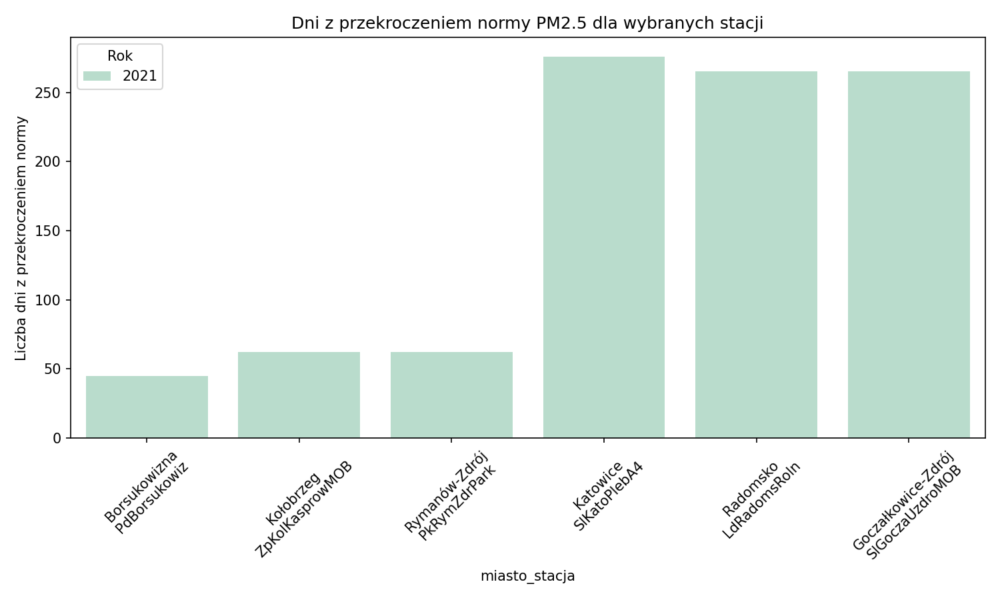
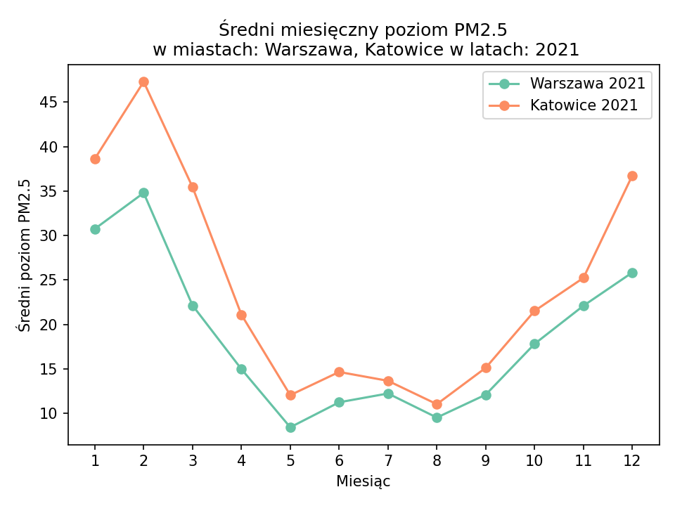
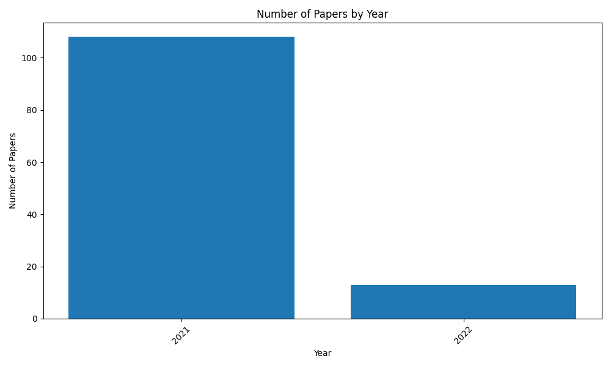

# Task 4 - Raport końcowy

Analiza jakości powietrza (PM2.5) oraz literatury naukowej (PubMed).

**Lata:** 2021, 2024

**Miasta:** Warszawa, Katowice

## PM2.5 - podsumowanie

Tabela przedstawia liczbę dni z przekroczeniem normy PM2.5.

Liczba dni w roku, w których średnie dobowe stężenie PM2.5 przekroczyło obowiązującą normę.

| Miejscowość         |   2021 |   2024 |
|:--------------------|-------:|-------:|
| Augustów            |    158 |    156 |
| Białystok           |    137 |    328 |
| Bielsko-Biała       |    248 |    171 |
| Biskupiec           |    163 |    nan |
| Borsukowizna        |     45 |     22 |
| Brzeg               |    156 |    nan |
| Bydgoszcz           |    244 |    231 |
| Dębica              |    182 |    185 |
| Elbląg              |    137 |    100 |
| Ełk                 |     71 |    100 |
| Gdańsk              |    138 |    247 |
| Gdynia              |    267 |    143 |
| Goczałkowice-Zdrój  |    265 |    139 |
| Gorzów Wielkopolski |    138 |    115 |
| Grajewo             |    167 |     83 |
| Gubin               |    138 |    nan |
| Guty Duże           |    104 |    nan |
| Jarosław            |    211 |    128 |
| Jasło               |    155 |     89 |
| Jelenia Góra        |    162 |    109 |
| Kalisz              |    209 |    163 |
| Katowice            |    490 |    432 |
| Kielce              |    251 |    nan |
| Konstancin-Jeziorna |    148 |    102 |
| Kołobrzeg           |     62 |     58 |
| Kościerzyna         |    169 |    102 |
| Kraków              |    473 |    330 |
| Krosno              |    136 |     65 |
| Kutno               |    184 |    181 |
| Kędzierzyn-Koźle    |    178 |    111 |
| Kłodzko             |    211 |    129 |
| Latoszyn            |    134 |    nan |
| Legionowo           |    168 |    121 |
| Lublin              |    246 |    170 |
| Lębork              |    135 |    nan |
| Mielec              |    191 |    144 |
| Milicz              |    173 |    nan |
| Nakło nad Notecią   |    180 |    136 |
| Nisko               |    203 |    149 |
| Nysa                |    153 |    nan |
| Olsztyn             |    130 |    139 |
| Opatów              |    215 |    nan |
| Opole               |    129 |    120 |
| Ostróda             |    142 |    nan |
| Otwock              |    183 |    135 |
| Piastów             |    185 |    124 |
| Poznań              |    167 |    270 |
| Przemyśl            |    180 |    146 |
| Płock               |    156 |    131 |
| Racibórz            |    260 |    186 |
| Radom               |    194 |    161 |
| Radomsko            |    265 |    156 |
| Rymanów-Zdrój       |     62 |     37 |
| Rzeszów             |    231 |    396 |
| Sandomierz          |    207 |    nan |
| Siedlce             |    177 |     79 |
| Sierpc              |    191 |    nan |
| Solec Kujawski      |    171 |    nan |
| Sopot               |     98 |    123 |
| Starachowice        |    222 |    145 |
| Suwałki             |    110 |     69 |
| Szamotuły           |    133 |    nan |
| Szczecin            |    212 |    202 |
| Tarnów              |    210 |     97 |
| Toruń               |    175 |    140 |
| Warszawa            |    887 |    807 |
| Wrocław             |    368 |    264 |
| Wschowa             |    165 |     98 |
| Włocławek           |    196 |    182 |
| Zamość              |    190 |    152 |
| Zgierz              |    201 |    189 |
| Zielona Góra        |     92 |    145 |
| Złoty Potok         |    179 |    117 |
| Łask                |    228 |    157 |
| Łódź                |    175 |    128 |
| Środa Śląska        |    212 |    nan |
| Żary                |    105 |     83 |
| Żyrardów            |    200 |    142 |
| Biała               |    nan |    127 |
| Boguchwała          |    nan |    104 |
| Bytów               |    nan |     80 |
| Chojnów             |    nan |    170 |
| Działdowo           |    nan |    160 |
| Dąbki               |    nan |     73 |
| Jastrzębie-Zdrój    |    nan |    200 |
| Kościan             |    nan |    143 |
| Kudowa-Zdrój        |    nan |     98 |
| Lubsko              |    nan |     81 |
| Połaniec            |    nan |    150 |
| Pułtusk             |    nan |    130 |
| Skarżysko-Kamienna  |    nan |    185 |
| Strzelce Opolskie   |    nan |     92 |
| Łagów               |    nan |    131 |
| Łuków               |    nan |    137 |
| Świecie             |    nan |     92 |
| Żywiec              |    nan |    147 |

Średnie miesięczne wartości PM2.5 (uśrednione po wszystkich stacjach).

**Liczba dni z przekroczeniem normy PM2.5 dla roku 2021 (najwyższe i najniższe wartości):**

**Liczba dni z przekroczeniem normy PM2.5 dla roku 2024 (najwyższe i najniższe wartości):**

### Rok 2021

| ('Miejscowość', 'Kod stacji')   | ('', '')   |   ('Jelenia Góra', 'DsJelGorOgin') |   ('Kłodzko', 'DsKlodzSzkol') |   ('Milicz', 'DsMiliczMOB') |   ('Środa Śląska', 'DsSrodaSlMOB') |   ('Wrocław', 'DsWrocAlWisn') |   ('Wrocław', 'DsWrocWybCon') |   ('Bydgoszcz', 'KpBydPlPozna') |   ('Bydgoszcz', 'KpBydWarszaw') |   ('Nakło nad Notecią', 'KpNaklWawrzy') |   ('Solec Kujawski', 'KpSolecRowecMOB') |   ('Toruń', 'KpToruKaszow') |   ('Włocławek', 'KpWloclOkrze') |   ('Lublin', 'LbLubObywate') |   ('Zamość', 'LbZamoHrubie') |   ('Kutno', 'LdKutn1Maja7MOB') |   ('Łask', 'LdLaskNarutoMOB') |   ('Łódź', 'LdLodzCzerni') |   ('Radomsko', 'LdRadomsRoln') |   ('Zgierz', 'LdZgieMielcz') |   ('Gorzów Wielkopolski', 'LuGorzKosGdy') |   ('Gubin', 'LuGubinAnderMOB') |   ('Wschowa', 'LuWsKaziWiel') |   ('Żary', 'LuZarySzyman') |   ('Zielona Góra', 'LuZielKrotka') |   ('Kraków', 'MpKrakAlKras') |   ('Kraków', 'MpKrakBulwar') |   ('Tarnów', 'MpTarRoSitko') |   ('Guty Duże', 'MzGutyDuCzer') |   ('Konstancin-Jeziorna', 'MzKonJezWieMOB') |   ('Legionowo', 'MzLegZegrzyn') |   ('Otwock', 'MzOtwoBrzozo') |   ('Piastów', 'MzPiasPulask') |   ('Płock', 'MzPlocMiReja') |   ('Radom', 'MzRadTochter') |   ('Siedlce', 'MzSiedKonars') |   ('Sierpc', 'MzSierWiosnyMOB') |   ('Warszawa', 'MzWarAlNiepo') |   ('Warszawa', 'MzWarBajkowa') |   ('Warszawa', 'MzWarChrosci') |   ('Warszawa', 'MzWarTolstoj') |   ('Warszawa', 'MzWarWokalna') |   ('Żyrardów', 'MzZyraRoosev') |   ('Brzeg', 'OpBrzegPoprz') |   ('Kędzierzyn-Koźle', 'OpKKozBSmial') |   ('Nysa', 'OpNysaRodzie') |   ('Opole', 'OpOpoleKoszy') |   ('Augustów', 'PdAugustowUz') |   ('Białystok', 'PdBialUpalna') |   ('Borsukowizna', 'PdBorsukowiz') |   ('Grajewo', 'PdGrajewoWPoMOB') |   ('Suwałki', 'PdSuwPulask2') |   ('Dębica', 'PkDebiGrottg') |   ('Jarosław', 'PkJarosPruch') |   ('Jasło', 'PkJasloSikor') |   ('Krosno', 'PkKrosKletow') |   ('Latoszyn', 'PkLatosZdrojMOB') |   ('Mielec', 'PkMielBierna') |   ('Nisko', 'PkNiskoSzkla') |   ('Przemyśl', 'PkPrzemGrunw') |   ('Rymanów-Zdrój', 'PkRymZdrPark') |   ('Rzeszów', 'PkRzeszPilsu') |   ('Gdańsk', 'PmGdaLeczkow') |   ('Gdynia', 'PmGdyPorebsk') |   ('Gdynia', 'PmGdySzafran') |   ('Kościerzyna', 'PmKosTargowa') |   ('Lębork', 'PmLebMalczew') |   ('Sopot', 'PmSopBiPlowc') |   ('Kielce', 'SkKielTargow') |   ('Opatów', 'SkOpatPartyz') |   ('Sandomierz', 'SkSandZielnaMOB') |   ('Starachowice', 'SkStaraZlota') |   ('Bielsko-Biała', 'SlBielPartyz') |   ('Goczałkowice-Zdrój', 'SlGoczaUzdroMOB') |   ('Katowice', 'SlKatoKossut') |   ('Katowice', 'SlKatoPlebA4') |   ('Racibórz', 'SlRaciborzWPMOB') |   ('Złoty Potok', 'SlZlotPotLes') |   ('Biskupiec', 'WmBiskupMickMOB') |   ('Elbląg', 'WmElbBazynsk') |   ('Ełk', 'WmElkStadion') |   ('Olsztyn', 'WmOlsPuszkin') |   ('Ostróda', 'WmOstrPilsud') |   ('Kalisz', 'WpKaliSawick') |   ('Poznań', 'WpPoznDabrow') |   ('Szamotuły', 'WpSzamotKollMOB') |   ('Kołobrzeg', 'ZpKolKasprowMOB') |   ('Szczecin', 'ZpSzczAndrze') |   ('Szczecin', 'ZpSzczPilsud') |
|:--------------------------------|:-----------|-----------------------------------:|------------------------------:|----------------------------:|-----------------------------------:|------------------------------:|------------------------------:|--------------------------------:|--------------------------------:|----------------------------------------:|----------------------------------------:|----------------------------:|--------------------------------:|-----------------------------:|-----------------------------:|-------------------------------:|------------------------------:|---------------------------:|-------------------------------:|-----------------------------:|------------------------------------------:|-------------------------------:|------------------------------:|---------------------------:|-----------------------------------:|-----------------------------:|-----------------------------:|-----------------------------:|--------------------------------:|--------------------------------------------:|--------------------------------:|-----------------------------:|------------------------------:|----------------------------:|----------------------------:|------------------------------:|--------------------------------:|-------------------------------:|-------------------------------:|-------------------------------:|-------------------------------:|-------------------------------:|-------------------------------:|----------------------------:|---------------------------------------:|---------------------------:|----------------------------:|-------------------------------:|--------------------------------:|-----------------------------------:|---------------------------------:|------------------------------:|-----------------------------:|-------------------------------:|----------------------------:|-----------------------------:|----------------------------------:|-----------------------------:|----------------------------:|-------------------------------:|------------------------------------:|------------------------------:|-----------------------------:|-----------------------------:|-----------------------------:|----------------------------------:|-----------------------------:|----------------------------:|-----------------------------:|-----------------------------:|------------------------------------:|-----------------------------------:|------------------------------------:|--------------------------------------------:|-------------------------------:|-------------------------------:|----------------------------------:|----------------------------------:|-----------------------------------:|-----------------------------:|--------------------------:|------------------------------:|------------------------------:|-----------------------------:|-----------------------------:|-----------------------------------:|-----------------------------------:|-------------------------------:|-------------------------------:|
| rok                             | miesiąc    |                          nan       |                     nan       |                   nan       |                          nan       |                      nan      |                     nan       |                       nan       |                       nan       |                                nan      |                               nan       |                    nan      |                        nan      |                     nan      |                    nan       |                      nan       |                     nan       |                  nan       |                       nan      |                    nan       |                                 nan       |                      nan       |                     nan       |                  nan       |                          nan       |                     nan      |                     nan      |                    nan       |                       nan       |                                   nan       |                       nan       |                    nan       |                     nan       |                   nan       |                   nan       |                     nan       |                       nan       |                       nan      |                      nan       |                      nan       |                      nan       |                      nan       |                      nan       |                   nan       |                              nan       |                  nan       |                   nan       |                      nan       |                       nan       |                          nan       |                        nan       |                     nan       |                    nan       |                       nan      |                   nan       |                    nan       |                         nan       |                    nan       |                   nan       |                      nan       |                           nan       |                     nan       |                    nan       |                    nan       |                    nan       |                          nan      |                    nan       |                   nan       |                     nan      |                    nan       |                           nan       |                           nan      |                            nan      |                                    nan      |                       nan      |                       nan      |                          nan      |                         nan       |                          nan       |                    nan       |                 nan       |                     nan       |                     nan       |                     nan      |                    nan       |                          nan       |                          nan       |                      nan       |                      nan       |
| 2021                            | 1          |                           29.9017  |                      44.3845  |                    28.7979  |                           37.996   |                       29.3505 |                      26.8052  |                        29.0573  |                        22.5695  |                                 40.2015 |                                28.2936  |                     30.6046 |                         31.4758 |                      38.3333 |                     25.4096  |                       32.9433  |                      39.7708  |                   28.0215  |                        35.0062 |                     41.2234  |                                  20.8437  |                       25.2445  |                      30.7692  |                   17.9754  |                           17.003   |                      34.6336 |                      36.3138 |                     35.6997  |                        23.2298  |                                    30.8393  |                        36.5435  |                     37.5187  |                      35.0713  |                    29.0653  |                    36.0103  |                      37.0077  |                        35.5566  |                        32.4764 |                       33.5965  |                       31.0071  |                       28.1505  |                       28.5159  |                       37.3422  |                    26.2709  |                               33.6323  |                   30.9478  |                    27.3029  |                       28.8428  |                        27.469   |                           16.1278  |                         34.7403  |                      23.0796  |                     37.0477  |                        27.6231 |                    24.7561  |                     19.8383  |                          24.0992  |                     38.1062  |                    29.7821  |                       29.3147  |                            14.5541  |                      32.9138  |                     26.4232  |                     27.4111  |                     22.0569  |                           27.7616 |                     20.4239  |                   nan       |                      33.3803 |                     42.0324  |                            28.9004  |                            29.8783 |                             39.4851 |                                     48.7114 |                        36.5161 |                        40.7338 |                           46.9802 |                          25.535   |                           28.7239  |                     29.2752  |                  18.716   |                      25.0538  |                      26.6564  |                      30.1699 |                     27.6628  |                          nan       |                           12.5792  |                       15.8316  |                       15.6842  |
| 2021                            | 2          |                           34.2371  |                      57.4159  |                    39.3739  |                           46.5223  |                       37.2391 |                      33.6394  |                        41.7373  |                        35.3872  |                                 63.3578 |                                47.715   |                     42.8214 |                         44.4092 |                      43.3061 |                     30.515   |                       43.3318  |                      47.5817  |                   33.9018  |                        47.5873 |                     38.9057  |                                  34.5278  |                       37.316   |                      36.2236  |                   25.1884  |                           22.7723  |                      49.7395 |                      51.0009 |                     36.6139  |                        26.8139  |                                    33.8379  |                        40.628   |                     45.6207  |                      38.5876  |                    36.6644  |                    41.9648  |                      40.739   |                        53.5939  |                        37.3508 |                       38.7415  |                       33.813   |                       31.7454  |                       32.3139  |                       45.0721  |                    42.8175  |                               38.8625  |                   45.595   |                    34.0834  |                       38.9251  |                        31.0663  |                           15.4837  |                         42.9224  |                      28.7397  |                     39.5061  |                        35.8853 |                    34.487   |                     29.3872  |                          29.6073  |                     47.422   |                    40.9044  |                       39.0669  |                            18.8088  |                      41.2743  |                     34.4529  |                     29.7602  |                     26.7617  |                           46.0808 |                     32.0177  |                    27.8263  |                      47.3018 |                     45.6267  |                            35.1597  |                            35.8959 |                             53.18   |                                     77.4775 |                        46.1798 |                        48.3852 |                           56.0113 |                          34.4042  |                           38.956   |                     35.8648  |                  24.0798  |                      28.9109  |                      35.8022  |                      40.4918 |                     35.6317  |                          nan       |                           18.973   |                       25.0767  |                       19.3585  |
| 2021                            | 3          |                           26.88    |                      47.9769  |                    28.6695  |                           35.538   |                       26.8932 |                      23.2611  |                        21.8341  |                        17.5587  |                                 31.3593 |                                28.0712  |                     23.662  |                         27.1514 |                      31.5977 |                     28.0082  |                       26.8297  |                      38.0983  |                   21.4872  |                        42.6449 |                     29.1213  |                                  21.7077  |                       21.4229  |                      31.5357  |                   20.8424  |                           13.6567  |                      33.7997 |                      31.9511 |                     34.4202  |                        13.2681  |                                    20.8395  |                        26.3538  |                     27.9262  |                      25.3469  |                    19.5892  |                    31.7398  |                      25.104   |                        29.8828  |                        25.9131 |                       24.7351  |                       21.5853  |                       19.1597  |                       19.3776  |                       28.7624  |                    29.3842  |                               24.9345  |                   24.9803  |                    22.112   |                       20.2785  |                        17.7376  |                            8.29608 |                         21.7316  |                      16.226   |                     35.152   |                        29.166  |                    26.6041  |                     24.9124  |                          22.4491  |                     35.3657  |                    29.0962  |                       26.8481  |                            14.9474  |                      35.3635  |                     20.3987  |                     20.0222  |                     17.7218  |                           24.1726 |                     18.6139  |                    17.1005  |                      28.4826 |                     41.2309  |                            26.8186  |                            26.6269 |                             37.341  |                                     47.6768 |                        33.7871 |                        37.0974 |                           38.8369 |                          22.644   |                           21.124   |                     20.4677  |                  10.3687  |                      17.6057  |                      17.949   |                      29.2373 |                     24.4828  |                           41.5034  |                           12.7779  |                       16.3837  |                       23.7088  |
| 2021                            | 4          |                           16.0383  |                      23.7706  |                    17.113   |                           20.8816  |                       16.8489 |                      14.3801  |                        13.228   |                        11.4642  |                                 18.8069 |                                15.7362  |                     15.7178 |                         17.5844 |                      18.9261 |                     19.0518  |                       18.2652  |                      22.9027  |                   14.9264  |                        26.6144 |                     17.1569  |                                  13.2259  |                       11.2204  |                      19.1071  |                   11.6632  |                            9.72434 |                      21.8807 |                      19.676  |                     20.172   |                         9.271   |                                    13.8303  |                        17.0505  |                     17.8932  |                      16.5664  |                    13.4176  |                    17.1915  |                      15.3931  |                        18.639   |                        18.4298 |                       15.4673  |                       14.2279  |                       13.1655  |                       13.7009  |                       19.7252  |                    18.4748  |                               14.037   |                   15.5416  |                    13.948   |                       14.3202  |                        13.5559  |                            6.34924 |                         14.9312  |                      10.2753  |                     19.1407  |                        17.5626 |                    14.5703  |                     14.3667  |                          14.0845  |                     17.26    |                    16.31    |                       14.4375  |                             8.74846 |                      23.8706  |                     14.589   |                     13.5254  |                     12.8538  |                           19.2944 |                     11.575   |                    12.8277  |                      19.3354 |                     25.0217  |                            17.7981  |                            18.8613 |                             25.5994 |                                     29.6005 |                        19.9943 |                        22.2296 |                           23.9795 |                          16.3649  |                           14.9793  |                     14.3414  |                   7.49626 |                      11.878   |                      12.8817  |                      19.0316 |                     14.3288  |                           20.3367  |                            8.78513 |                       11.3842  |                       13.1213  |
| 2021                            | 5          |                            8.56405 |                      10.7476  |                     8.48906 |                            9.91732 |                       11.3108 |                       8.33706 |                         5.45901 |                         7.91788 |                                 10.8961 |                                 9.14757 |                     10.0137 |                         11.0703 |                      12.3039 |                     10.0293  |                        8.59005 |                      10.3208  |                    7.9852  |                        12.0806 |                      9.94245 |                                   8.15083 |                        7.38328 |                       9.97282 |                    8.66275 |                            6.0108  |                      12.6    |                      11.0795 |                      9.46056 |                         5.65594 |                                     7.12582 |                         9.27325 |                      8.09516 |                       8.69781 |                     7.25278 |                     8.94376 |                       8.34927 |                        10.4203  |                        12.0143 |                        7.8313  |                        7.7331  |                        7.21973 |                        7.49179 |                        9.42724 |                     8.73819 |                                7.78435 |                    8.01545 |                     6.69991 |                        9.08151 |                         9.17204 |                            3.68065 |                          9.48831 |                       7.54624 |                      7.52491 |                        10.2609 |                     8.14185 |                      7.2665  |                           8.13496 |                      9.70438 |                     9.68688 |                        7.411   |                             5.07449 |                      17.4677  |                     10.8377  |                     11.3973  |                     10.6259  |                           11.7982 |                      6.90492 |                    10.3496  |                      12.8859 |                     10.448   |                             9.71326 |                            10.387  |                             12.981  |                                     13.8952 |                        10.1322 |                        14.0101 |                           11.8431 |                          10.9177  |                            9.57713 |                      9.34767 |                   5.24258 |                       8.02837 |                       8.2761  |                       9.9129 |                      8.85476 |                           10.8475  |                            7.6207  |                        8.83179 |                        9.86409 |
| 2021                            | 6          |                           12.9181  |                      14.258   |                    12.5466  |                           14.4802  |                       16.2283 |                      12.7958  |                         6.94323 |                         9.42938 |                                 11.2396 |                                12.117   |                     12.7111 |                         12.8143 |                      15.3524 |                     12.2681  |                       10.617   |                      13.9966  |                   10.3963  |                        19.8621 |                     13.4212  |                                  12.2877  |                       12.5967  |                      13.2153  |                   11.5987  |                            9.11972 |                      14.909  |                      13.673  |                     12.0433  |                         7.63561 |                                     8.85105 |                        11.3916  |                     11.1788  |                      12.0405  |                    10.1911  |                    12.2806  |                       9.36344 |                        11.7442  |                        15.2222 |                       10.3528  |                       10.4947  |                       10.3179  |                        9.94736 |                       12.5138  |                    12.8849  |                               13.1123  |                   10.4371  |                    10.7499  |                        9.92336 |                        10.8359  |                            6.71182 |                         10.4822  |                       8.05857 |                     10.8642  |                        12.6191 |                     8.94628 |                     11.0101  |                          11.0123  |                     13.0044  |                    13.5581  |                       11.3275  |                             7.60341 |                      14.3709  |                     12.1575  |                     12.5984  |                     12.4757  |                           12.9119 |                      9.0564  |                    11.7944  |                      15.0861 |                     11.6479  |                            11.9711  |                            14.8596 |                             16.4844 |                                     17.4692 |                        12.8389 |                        16.5099 |                           16.3253 |                          12.2041  |                           10.5207  |                      9.69578 |                   7.69045 |                      10.1062  |                      10.9701  |                      13.4362 |                     13.4105  |                           13.6955  |                           10.4288  |                       11.4031  |                       13.8835  |
| 2021                            | 7          |                           10.7342  |                      10.8727  |                     7.90607 |                           11.4357  |                       13.914  |                      11.2012  |                        10.4125  |                        10.8646  |                                 11.8105 |                                12.9648  |                     13.9811 |                         13.4746 |                      15.8566 |                     12.7293  |                       10.7     |                      12.8924  |                   10.2424  |                        17.0854 |                     17.0391  |                                  10.5211  |                       10.4478  |                      11.4988  |                    9.99049 |                            7.71023 |                      14.8465 |                      13.8505 |                     13.6847  |                         9.01665 |                                     9.39371 |                        12.5227  |                     10.6314  |                      11.8006  |                    11.3141  |                    11.233   |                      12.1637  |                        12.4178  |                        15.7749 |                       11.1127  |                       10.9053  |                       12.9076  |                       10.582   |                       12.3592  |                     9.95236 |                               10.7709  |                    7.93748 |                     9.4328  |                       12.7797  |                        11.7737  |                            8.55847 |                         12.5934  |                       8.45331 |                     11.3722  |                        14.8149 |                     8.37903 |                     11.1892  |                          11.708   |                     11.3494  |                    13.9824  |                       12.8924  |                             8.90305 |                      13.4873  |                     12.5787  |                     12.3987  |                     12.9385  |                           12.8853 |                      8.24736 |                    12.3431  |                      15.0326 |                     11.019   |                            12.6242  |                            14.3196 |                             14.7553 |                                     15.4483 |                        11.6053 |                        15.7543 |                           13.4624 |                          11.6246  |                           11.6253  |                     10.0307  |                   8.96834 |                      11.2818  |                      12.4337  |                      14.3876 |                     12.905   |                           11.9458  |                            9.67565 |                        9.57228 |                       11.363   |
| 2021                            | 8          |                            8.09521 |                       8.17352 |                     9.40853 |                            8.28431 |                       11.1714 |                       8.40148 |                         5.69618 |                         7.9227  |                                  7.7129 |                                 8.61753 |                      9.6211 |                         11.0194 |                      13.1005 |                      9.14167 |                        8.63388 |                       9.81373 |                    8.54717 |                        13.7879 |                     11.4537  |                                   6.51222 |                        7.4315  |                       9.46754 |                    7.36439 |                            6.2485  |                      13.2608 |                       9.258  |                     10.1289  |                         6.20555 |                                     6.6325  |                         8.91637 |                      8.50135 |                       9.09808 |                     8.16712 |                     9.77237 |                       9.64257 |                         9.45489 |                        12.8843 |                        8.73503 |                        8.49415 |                        9.00939 |                        8.63294 |                        9.92027 |                     6.81922 |                                8.47247 |                    8.6934  |                     6.50305 |                        8.53976 |                         8.04626 |                            4.65699 |                          8.98602 |                       8.0935  |                      6.80831 |                        11.3653 |                     6.13473 |                      6.97233 |                           8.24839 |                      8.77178 |                     9.78656 |                        9.31546 |                             5.49866 |                       9.57283 |                      8.88255 |                      8.27439 |                      9.14297 |                            9.2112 |                      5.90644 |                     8.55649 |                      13.0259 |                      8.93905 |                            10.7038  |                            10.9745 |                             10.8627 |                                     10.904  |                         9.1833 |                        12.9266 |                           10.5015 |                           9.72406 |                            8.71075 |                      6.84373 |                   5.44986 |                       7.70446 |                       8.38875 |                      11.4906 |                      9.3926  |                            8.06691 |                            6.26355 |                        6.79472 |                        6.98125 |
| 2021                            | 9          |                           12.8491  |                      14.3999  |                    13.5367  |                           12.9034  |                       16.6878 |                      12.6545  |                         8.77857 |                        10.0943  |                                 11.9858 |                                12.0215  |                     12.6839 |                         13.5155 |                      16.6701 |                     13.4015  |                       12.0827  |                      14.7049  |                   11.3736  |                        19.0414 |                     13.4523  |                                  10.7762  |                       10.9205  |                      13.6988  |                    9.72408 |                            8.50794 |                      16.5233 |                      17.7669 |                     15.8292  |                         8.44515 |                                     8.72505 |                        11.8104  |                     13.2575  |                      11.3197  |                    11.7405  |                    12.3055  |                      12.8338  |                        13.4609  |                        14.6736 |                       11.3934  |                       10.5885  |                       12.7708  |                       11.1794  |                       13.4331  |                    11.6988  |                               13.0713  |                   14.1901  |                    10.5827  |                        9.99753 |                         9.68707 |                            4.15147 |                         11.0222  |                       9.44217 |                     15.705   |                        13.5769 |                    10.5183  |                     10.6202  |                          10.3285  |                     12.3502  |                    14.1629  |                       11.4392  |                             7.55582 |                      14.9468  |                     11.964   |                     11.0694  |                     12.8104  |                           15.7303 |                      9.27856 |                    11.4877  |                      16.3257 |                     13.6132  |                            13.8497  |                            15.4639 |                             16.6634 |                                     17.5259 |                        13.4826 |                        16.7984 |                           17.744  |                          12.1494  |                           11.1722  |                      9.38037 |                   6.77783 |                       8.786   |                      11.0897  |                      14.9733 |                     12.3723  |                           13.1654  |                            9.28792 |                        9.62418 |                       12.2208  |
| 2021                            | 10         |                           19.1659  |                      25.9702  |                    18.2359  |                           16.8062  |                       19.7993 |                      16.1977  |                        14.6453  |                        15.8207  |                                 26.4225 |                                21.4687  |                     20.444  |                         21.0264 |                      25.5956 |                     21.9813  |                       18.9919  |                      22.9881  |                   17.0768  |                        25.5035 |                     17.4452  |                                  14.8163  |                       16.8718  |                      20.7272  |                   15.1201  |                           10.8592  |                      24.7959 |                      25.6226 |                     22.309   |                        16.1814  |                                    17.4814  |                        18.1634  |                     22.4804  |                      18.0783  |                    18.0575  |                    19.3376  |                      20.1458  |                        22.4571  |                        18.9016 |                       18.4499  |                       16.9142  |                       18.563   |                       16.3077  |                       22.9417  |                    16.0081  |                               19.0132  |                   22.1794  |                    14.0624  |                       20.7907  |                        16.6872  |                            8.91534 |                         21.7063  |                      16.2402  |                     22.2045  |                        25.7936 |                    19.014   |                     17.485   |                          14.2303  |                     20.0807  |                    23.5483  |                       22.6155  |                            10.6433  |                      24.7337  |                     17.7606  |                     17.2738  |                     16.6248  |                           24.6314 |                     16.2332  |                    16.4696  |                      23.5376 |                     25.4228  |                            21.9393  |                            24.4637 |                             22.5202 |                                     32.7718 |                        19.8878 |                        23.1791 |                           25.994  |                          16.598   |                           17.8064  |                     14.9933  |                  11.2087  |                      15.6777  |                      17.7371  |                      20.8104 |                     19.0538  |                           26.242   |                            9.82473 |                       12.6088  |                       14.7303  |
| 2021                            | 11         |                           26.1157  |                      25.9174  |                    25.8524  |                           28.3964  |                       25.5419 |                      23.6713  |                        16.4296  |                        17.2255  |                                 28.386  |                                24.7439  |                     23.9803 |                         22.7792 |                      28.1618 |                     23.7676  |                       23.3262  |                      25.2552  |                   18.8181  |                        25.5212 |                     18.5974  |                                  20.4168  |                       19.0063  |                      21.5384  |                   16.6719  |                           16.4136  |                      28.9372 |                      30.2418 |                     27.2138  |                        17.595   |                                    22.7327  |                        24.8118  |                     23.8673  |                      22.3812  |                    20.3203  |                    23.7701  |                      23.2105  |                        26.1236  |                        23.2809 |                       23.3059  |                       21.4093  |                       22.5991  |                       19.9701  |                       25.2569  |                    23.0084  |                               21.1679  |                   28.5475  |                    18.5297  |                       22.1393  |                        18.7819  |                           10.1352  |                         21.8385  |                      16.6817  |                     28.1537  |                        26.7974 |                    20.713   |                     18.5096  |                          17.5496  |                     22.7837  |                    24.4481  |                       26.2475  |                            10.8872  |                      30.9284  |                     17.2577  |                     18.4575  |                     15.7826  |                           16.7162 |                     24.346   |                    15.9148  |                      25.1924 |                     31.6599  |                            24.9685  |                            31.091  |                             29.3904 |                                     34.1786 |                        23.2772 |                        27.2064 |                           29.7867 |                          18.6143  |                           18.946   |                     15.8685  |                  10.2305  |                      16.1646  |                      18.4423  |                      28.8502 |                     24.5153  |                           31.1629  |                           10.7689  |                       15.9453  |                       17.4577  |
| 2021                            | 12         |                           35.7686  |                      53.4329  |                    32.3745  |                           36.2885  |                       29.4653 |                      28.0767  |                        23.3673  |                        23.2072  |                                 41.3144 |                                32.155   |                     31.0352 |                         29.3552 |                      29.2602 |                     24.4056  |                       31.4046  |                      36.8536  |                   25.6492  |                        44.2324 |                     28.1667  |                                  32.511   |                       24.0729  |                      25.76    |                   18.1725  |                           17.5567  |                      38.2473 |                      37.3238 |                     40.0119  |                        17.5215  |                                    24.6494  |                        30.4792  |                     26.6619  |                      25.4044  |                    25.4231  |                    30.3042  |                      23.801   |                        31.1264  |                        26.6773 |                       25.9549  |                       24.4108  |                       29.7797  |                       22.4156  |                       31.1404  |                    29.3088  |                               32.2074  |                   41.335   |                    30.3501  |                       23.6716  |                        17.8146  |                            9.88616 |                         20.98    |                      16.566   |                     32.3759  |                        23.9586 |                    26.0472  |                     21.9734  |                          22.9196  |                     30.9295  |                    27.5511  |                       24.6996  |                            12.1526  |                      38.7761  |                     20.0183  |                     22.2528  |                     17.2875  |                           17.8064 |                     29.8762  |                    16.6811  |                      35.4851 |                     38.2269  |                            27.1175  |                            37.6527 |                             51.2618 |                                     53.4529 |                        35.0144 |                        38.4796 |                           45.5003 |                          23.7141  |                           21.3889  |                     18.5349  |                  10.197   |                      17.6728  |                      22.3799  |                      39.4787 |                     23.1147  |                           43.5218  |                           11.8548  |                       20.1853  |                       23.0204  |

**Trend średnich miesięcznych:**

### Rok 2024

| ('Miejscowość', 'Kod stacji')   | ('', '')   |   ('Chojnów', 'DsChojnowMalMOB') |   ('Jelenia Góra', 'DsJelGorOgin') |   ('Kłodzko', 'DsKlodzSzkol') |   ('Kudowa-Zdrój', 'DsKudowaSzkoMOB') |   ('Wrocław', 'DsWrocAlWisn') |   ('Wrocław', 'DsWrocWybCon') |   ('Bydgoszcz', 'KpBydPlPozna') |   ('Bydgoszcz', 'KpBydWarszaw') |   ('Nakło nad Notecią', 'KpNaklWawrzy') |   ('Świecie', 'KpSwiecJPawlMOB') |   ('Toruń', 'KpToruKaszow') |   ('Włocławek', 'KpWloclOkrze') |   ('Lublin', 'LbLubObywate') |   ('Łuków', 'LbLukBulNiepMOB') |   ('Zamość', 'LbZamoHrubie') |   ('Kutno', 'LdKutn1Maja7MOB') |   ('Łask', 'LdLaskNarutoMOB') |   ('Łódź', 'LdLodzCzerni') |   ('Radomsko', 'LdRadomsRoln') |   ('Zgierz', 'LdZgieMielcz') |   ('Gorzów Wielkopolski', 'LuGorzKosGdy') |   ('Lubsko', 'LuLubsStrzelMOB ') |   ('Wschowa', 'LuWsKaziWiel') |   ('Żary', 'LuZarySzyman') |   ('Zielona Góra', 'LuZielKrotka') |   ('Kraków', 'MpKrakAlKras') |   ('Kraków', 'MpKrakBulwar') |   ('Tarnów', 'MpTarRoSitko') |   ('Biała', 'MzBialaKmiciMOB') |   ('Konstancin-Jeziorna', 'MzKonJezZero') |   ('Legionowo', 'MzLegZegrzyn') |   ('Otwock', 'MzOtwoBrzozo') |   ('Piastów', 'MzPiasPulask') |   ('Płock', 'MzPlocMiReja') |   ('Pułtusk', 'MzPultuskMicMOB') |   ('Radom', 'MzRadTochter') |   ('Siedlce', 'MzSiedKonars') |   ('Warszawa', 'MzWarAlNiepo') |   ('Warszawa', 'MzWarBajkowa') |   ('Warszawa', 'MzWarChrosci') |   ('Warszawa', 'MzWarKondrat') |   ('Warszawa', 'MzWarTolstoj') |   ('Warszawa', 'MzWarWokalna') |   ('Żyrardów', 'MzZyraRoosev') |   ('Kędzierzyn-Koźle', 'OpKKozBSmial') |   ('Opole', 'OpOpoleKoszy') |   ('Strzelce Opolskie', 'OpStrzOpWyszMOB') |   ('Augustów', 'PdAugustowUz') |   ('Białystok', 'PdBialAlPils') |   ('Białystok', 'PdBialPPiech') |   ('Białystok', 'PdBialUpalna') |   ('Borsukowizna', 'PdBorsukowiz') |   ('Grajewo', 'PdGrajewoWPoMOB') |   ('Suwałki', 'PdSuwPulask2') |   ('Boguchwała', 'PkBoguchAngeMOB') |   ('Dębica', 'PkDebiGrottg') |   ('Jarosław', 'PkJarosPruch') |   ('Jasło', 'PkJasloSikor') |   ('Krosno', 'PkKrosKletow') |   ('Mielec', 'PkMielBierna') |   ('Nisko', 'PkNiskoSzkla') |   ('Przemyśl', 'PkPrzemGrunw') |   ('Rymanów-Zdrój', 'PkRymZdrPark') |   ('Rzeszów', 'PkRzeszPilsu') |   ('Rzeszów', 'PkRzeszSloci') |   ('Rzeszów', 'PkRzeszStarz') |   ('Bytów', 'PmBytowMila1MOB') |   ('Gdańsk', 'PmGdaLeczkow') |   ('Gdańsk', 'PmGdaWyzwole') |   ('Gdynia', 'PmGdyPorebsk') |   ('Kościerzyna', 'PmKosTargowa') |   ('Sopot', 'PmSopBiPlowc') |   ('Łagów', 'SkLagowZaploMOB') |   ('Połaniec', 'SkPolaRuszcz') |   ('Skarżysko-Kamienna', 'SkSkarz1MajaMOB') |   ('Starachowice', 'SkStaraZlota') |   ('Bielsko-Biała', 'SlBielPartyz') |   ('Goczałkowice-Zdrój', 'SlGoczaUzdroMOB') |   ('Jastrzębie-Zdrój', 'SlJastrZdroj') |   ('Katowice', 'SlKatoKossut') |   ('Katowice', 'SlKatoPlebA4') |   ('Racibórz', 'SlRaciborzWPMOB') |   ('Złoty Potok', 'SlZlotPotLes') |   ('Żywiec', 'SlZywieKoper') |   ('Działdowo', 'WmDzialPolnaMOB') |   ('Elbląg', 'WmElbBazynsk') |   ('Ełk', 'WmElkStadion') |   ('Olsztyn', 'WmOlsPuszkin') |   ('Kalisz', 'WpKaliSawick') |   ('Kościan', 'WpKoscianMayMOB') |   ('Poznań', 'WpPoznDabrow') |   ('Poznań', 'WpPoznSzwajc') |   ('Dąbki', 'ZpDabkiSztorMOB') |   ('Kołobrzeg', 'ZpKolZolkiew') |   ('Szczecin', 'ZpSzczAndrze') |   ('Szczecin', 'ZpSzczPilsud') |
|:--------------------------------|:-----------|---------------------------------:|-----------------------------------:|------------------------------:|--------------------------------------:|------------------------------:|------------------------------:|--------------------------------:|--------------------------------:|----------------------------------------:|---------------------------------:|----------------------------:|--------------------------------:|-----------------------------:|-------------------------------:|-----------------------------:|-------------------------------:|------------------------------:|---------------------------:|-------------------------------:|-----------------------------:|------------------------------------------:|---------------------------------:|------------------------------:|---------------------------:|-----------------------------------:|-----------------------------:|-----------------------------:|-----------------------------:|-------------------------------:|------------------------------------------:|--------------------------------:|-----------------------------:|------------------------------:|----------------------------:|---------------------------------:|----------------------------:|------------------------------:|-------------------------------:|-------------------------------:|-------------------------------:|-------------------------------:|-------------------------------:|-------------------------------:|-------------------------------:|---------------------------------------:|----------------------------:|-------------------------------------------:|-------------------------------:|--------------------------------:|--------------------------------:|--------------------------------:|-----------------------------------:|---------------------------------:|------------------------------:|------------------------------------:|-----------------------------:|-------------------------------:|----------------------------:|-----------------------------:|-----------------------------:|----------------------------:|-------------------------------:|------------------------------------:|------------------------------:|------------------------------:|------------------------------:|-------------------------------:|-----------------------------:|-----------------------------:|-----------------------------:|----------------------------------:|----------------------------:|-------------------------------:|-------------------------------:|--------------------------------------------:|-----------------------------------:|------------------------------------:|--------------------------------------------:|---------------------------------------:|-------------------------------:|-------------------------------:|----------------------------------:|----------------------------------:|-----------------------------:|-----------------------------------:|-----------------------------:|--------------------------:|------------------------------:|-----------------------------:|---------------------------------:|-----------------------------:|-----------------------------:|-------------------------------:|--------------------------------:|-------------------------------:|-------------------------------:|
| rok                             | miesiąc    |                         nan      |                          nan       |                     nan       |                             nan       |                     nan       |                     nan       |                       nan       |                       nan       |                               nan       |                        nan       |                    nan      |                       nan       |                     nan      |                      nan       |                     nan      |                       nan      |                     nan       |                  nan       |                       nan      |                    nan       |                                 nan       |                        nan       |                     nan       |                  nan       |                           nan      |                     nan      |                     nan      |                    nan       |                      nan       |                                 nan       |                       nan       |                    nan       |                     nan       |                   nan       |                        nan       |                    nan      |                     nan       |                      nan       |                      nan       |                      nan       |                      nan       |                      nan       |                      nan       |                      nan       |                              nan       |                   nan       |                                  nan       |                      nan       |                       nan       |                       nan       |                       nan       |                          nan       |                        nan       |                     nan       |                            nan      |                    nan       |                      nan       |                   nan       |                    nan       |                    nan       |                   nan       |                       nan      |                           nan       |                      nan      |                     nan       |                     nan       |                      nan       |                     nan      |                    nan       |                    nan       |                         nan       |                   nan       |                      nan       |                      nan       |                                   nan       |                          nan       |                            nan      |                                   nan       |                               nan      |                      nan       |                       nan      |                          nan      |                         nan       |                    nan       |                          nan       |                    nan       |                 nan       |                     nan       |                     nan      |                        nan       |                    nan       |                    nan       |                      nan       |                       nan       |                      nan       |                       nan      |
| 2024                            | 1          |                          25.4516 |                           23.2749  |                      32.6199  |                              21.9487  |                      24.5965  |                      20.2469  |                        17.4656  |                        19.8929  |                                23.5781  |                         16.7723  |                     19.0935 |                        26.9563  |                      22.482  |                       22.5851  |                      22.2335 |                        25.4127 |                      27.5778  |                   19.6516  |                        27.9231 |                     34.6381  |                                  20.136   |                         26.6852  |                      16.9242  |                   14.3263  |                            13.487  |                      25.0583 |                      26.5282 |                     22.2764  |                       18.4539  |                                  16.8288  |                        20.1673  |                     21.7801  |                      20.5221  |                    18.1285  |                         19.2853  |                     21.6237 |                      22.7035  |                       20.9673  |                       20.0215  |                       16.8185  |                       17.7696  |                       23.9531  |                       17.3824  |                       20.3571  |                               26.153   |                    37.8392  |                                   23.3843  |                       28.3946  |                        20.2258  |                        18.0588  |                        15.414   |                            9.04315 |                         16.0583  |                      13.1716  |                             12.9112 |                     30.4014  |                       25.4531  |                    19.1536  |                     19.795   |                     33.0868  |                    23.1707  |                        22.5017 |                            12.6895  |                       27.5085 |                      22.9139  |                      24.9137  |                       11.003   |                      16.5505 |                     13.2247  |                     15.8063  |                          20.0513  |                    14.3207  |                       22.9707  |                       29.5531  |                                    35.5839  |                           27.5896  |                             27.3048 |                                    30.4719  |                                28.9098 |                       25.7196  |                        32.2109 |                           28.4601 |                          17.1175  |                     27.9785  |                           34.1356  |                     15.7914  |                  14.0454  |                      18.5094  |                      24.5074 |                         30.3873  |                     27.042   |                     17.9546  |                       10.816   |                        10.7608  |                       11.5047  |                        14.529  |
| 2024                            | 2          |                          23.7279 |                           13.5062  |                      18.7997  |                              15.554   |                      16.5534  |                      14.0305  |                        14.6891  |                        16.0904  |                                19.7295  |                         13.1013  |                     14.9408 |                        23.6046  |                      17.857  |                       17.3122  |                      18.4921 |                        20.6878 |                      18.6412  |                   15.9209  |                        17.0588 |                     23.8985  |                                  13.8403  |                         12.4401  |                      14.5322  |                    8.41962 |                            13.3684 |                      21.9588 |                      19.7957 |                     16.0911  |                       16.7835  |                                  13.6023  |                        16.9144  |                     15.6509  |                      15.9611  |                    15.8905  |                         16.2536  |                     18.3503 |                      17.7358  |                       16.0032  |                       15.1777  |                       13.0158  |                       14.8208  |                       19.118   |                       13.6647  |                       17.7533  |                               13.5362  |                    24.424   |                                   12.3158  |                       17.2376  |                        15.9925  |                        12.3441  |                        11.0073  |                            5.52478 |                         12.0522  |                      12.3931  |                             16.8909 |                     19.8556  |                       19.3161  |                    11.8281  |                      9.44075 |                     18.4154  |                    19.0414  |                        20.9503 |                             9.94158 |                       21.9628 |                      16.1931  |                      16.0368  |                       10.0601  |                      15.185  |                     12.193   |                     16.8651  |                          14.0322  |                    13.1809  |                       20.0147  |                       18.8254  |                                    24.8291  |                           18.071   |                             18.8996 |                                    18.8092  |                                20.3677 |                       18.9108  |                        24.0866 |                           19.5124 |                          13.3023  |                     24.0871  |                           25.005   |                     14.1957  |                  15.071   |                      16.1422  |                      18.6193 |                         20.7402  |                     25.0671  |                     13.2599  |                       10.3272  |                        10.5156  |                        9.03511 |                        13.5395 |
| 2024                            | 3          |                          29.2716 |                           19.9343  |                      24.0953  |                              17.7692  |                      24.2412  |                      21.0382  |                        23.0968  |                        23.3586  |                                26.6121  |                         18.5608  |                     22.3655 |                        32.8751  |                      25.7542 |                       24.0804  |                      24.451  |                        28.6757 |                      29.8039  |                   21.4355  |                        25.7298 |                     29.8923  |                                  28.5655  |                         20.1435  |                      23.1085  |                   25.1872  |                            27.6891 |                      27.7129 |                      25.8497 |                     18.4929  |                       23.1607  |                                  19.2682  |                        22.5763  |                     21.7605  |                      21.605   |                    22.5191  |                         22.2454  |                     23.9499 |                      26.5257  |                       22.2751  |                       21.3078  |                       17.9144  |                       20.9072  |                       26.5065  |                       18.6942  |                       25.4715  |                               20.0681  |                    22.6941  |                                   19.2798  |                       21.0237  |                        22.9456  |                        17.1942  |                        17.3069  |                           10.1135  |                         18.3041  |                      14.6264  |                             17.9737 |                     26.0964  |                       22.304   |                    13.8135  |                     11.9272  |                     23.9526  |                    21.7669  |                        23.7296 |                            11.8117  |                       27.5958 |                      20.1376  |                      21.1824  |                       18.2038  |                      22.5792 |                     17.9399  |                     23.0823  |                          21.4059  |                    20.2922  |                       22.6942  |                       24.1704  |                                    29.5942  |                           25.333   |                             27.1272 |                                    24.7492  |                                26.7746 |                       24.6512  |                        30.7968 |                           25.9141 |                          20.7783  |                     28.3537  |                           29.7397  |                     19.011   |                  18.6106  |                      21.3894  |                      28.0211 |                         29.462   |                     29.8078  |                     24.2113  |                       22.6563  |                        17.8636  |                       25.6095  |                        28.6413 |
| 2024                            | 4          |                          14.8887 |                            9.88653 |                      11.3263  |                               8.65174 |                      11.8944  |                       9.80362 |                        11.3108  |                        10.4337  |                                12.081   |                          9.22194 |                     13.8165 |                        15.9372  |                      14.3338 |                       14.8333  |                      13.8503 |                        15.2897 |                      14.1622  |                    9.44134 |                        13.5004 |                     14.0854  |                                   9.84833 |                          7.77264 |                       9.71306 |                   11.4126  |                            14.0256 |                      15.3679 |                      14.0074 |                     10.361   |                       11.7262  |                                  10.3185  |                        11.688   |                     11.9103  |                      11.8844  |                    11.1593  |                         11.6721  |                     14.0715 |                      13.6606  |                       13.7794  |                       12.2197  |                       10.2617  |                       11.4135  |                       14.5525  |                       10.3706  |                       11.6457  |                                9.39847 |                     8.44056 |                                    8.41769 |                       12.0061  |                        13.3363  |                        10.2671  |                        10.525   |                            4.99066 |                         11.4503  |                       9.11736 |                             13.7699 |                     12.5689  |                       12.4528  |                     7.97365 |                      7.49298 |                     13.2454  |                    11.5744  |                        13.0232 |                             7.70486 |                       16.6899 |                      11.9478  |                      11.2686  |                       12.759   |                      15.1312 |                     14.5127  |                     15.5108  |                          15.7124  |                    13.55    |                       11.9729  |                       13.7672  |                                    14.6221  |                           12.3181  |                             16.2617 |                                    12.3191  |                                15.6092 |                       13.3983  |                        18.6868 |                           14.5327 |                          11.42    |                     13.5699  |                           13.6549  |                      9.92667 |                  10.5508  |                      12.7896  |                      13.4712 |                         11.8031  |                     13.5127  |                     12.3719  |                       10.8456  |                         7.54042 |                        9.18092 |                        13.8844 |
| 2024                            | 5          |                          11.883  |                            8.23468 |                       7.95148 |                               7.2397  |                      11.0413  |                       9.18427 |                        10.8731  |                         9.57363 |                                 9.92016 |                          9.99637 |                     12.9225 |                        13.1158  |                      10.4833 |                       11.2368  |                      10.1535 |                        12.897  |                      11.2368  |                   10.5571  |                        11.0292 |                      8.74166 |                                  10.4109  |                          7.06788 |                       7.54637 |                   12.6676  |                            18.8923 |                      13.2499 |                      10.7712 |                      7.64987 |                       11.6471  |                                   8.28683 |                         9.50349 |                      9.96734 |                       9.08185 |                     9.85269 |                          9.77634 |                     11.1777 |                       9.88477 |                       11.3663  |                        9.85161 |                        7.82661 |                        9.49583 |                       11.6324  |                        7.9796  |                        9.66959 |                                8.02853 |                     7.34583 |                                    7.47881 |                       11.828   |                        11.6391  |                         9.68062 |                        10.6102  |                            5.28733 |                         10.1813  |                       8.96783 |                             10.8367 |                      8.29922 |                        8.46532 |                     5.31465 |                      5.00517 |                     10.2329  |                     9.26977 |                        10.6687 |                             5.61344 |                       13.2892 |                       8.78538 |                       8.55718 |                       11.9364  |                      14.4505 |                     13.3292  |                     13.6883  |                          11.3482  |                    13.1527  |                        9.69852 |                       10.1008  |                                     9.43965 |                           10.3221  |                             12.6009 |                                     9.26833 |                                12.8184 |                        9.58881 |                        15.0894 |                           12.1691 |                           8.57823 |                      9.23965 |                            8.88078 |                      7.50417 |                   9.21252 |                      12.6699  |                      12.6827 |                          9.27056 |                     11.5448  |                     11.5852  |                       12.2759  |                         9.6475  |                        9.60941 |                        14.0055 |
| 2024                            | 6          |                          12.5518 |                            9.51333 |                       8.05361 |                               9.96405 |                      10.5095  |                       9.42962 |                         8.96173 |                         9.07472 |                                 8.87028 |                          9.39917 |                     11.8771 |                        10.0503  |                      11.3768 |                       11.6169  |                      10.2263 |                        12.1154 |                      10.541   |                    9.70417 |                        11.7891 |                      9.0098  |                                   9.69025 |                          7.56542 |                      11.1445  |                    8.61558 |                            15.5206 |                      12.5538 |                      11.8001 |                      7.97389 |                       10.4275  |                                   8.6602  |                         9.11569 |                      9.75833 |                       9.37097 |                     9.62857 |                          8.98122 |                     11.4886 |                      13.7196  |                       11.5047  |                       10.0637  |                        7.73014 |                        9.53396 |                       12.1393  |                        8.42409 |                        9.1681  |                                8.28875 |                     4.95444 |                                    8.54826 |                       10.7706  |                        11.0078  |                         8.59278 |                        10.5075  |                            5.33592 |                          8.92024 |                       6.94069 |                             10.8625 |                     12.0025  |                        7.24729 |                     7.76196 |                      5.50029 |                      9.98775 |                    11.1215  |                        10.9249 |                             6.93853 |                       11.8548 |                       8.17159 |                       7.43226 |                       10.3309  |                      12.3352 |                     10.8472  |                     12.3887  |                           9.83519 |                    11.5657  |                        9.55258 |                        9.14268 |                                     9.0025  |                            9.56252 |                             11.5181 |                                     9.10813 |                                12.9759 |                       11.9018  |                        16.5735 |                           12.2489 |                           9.74    |                      8.46    |                            7.67861 |                      9.34    |                   8.13681 |                      11.3559  |                      12.2783 |                          9.26299 |                     10.2482  |                     11.0667  |                       10.7165  |                         8.20986 |                        9.19108 |                        12.5201 |
| 2024                            | 7          |                          11.0288 |                            7.45376 |                       6.47809 |                               8.74058 |                       9.09769 |                       8.48293 |                         7.75873 |                         7.72291 |                                 7.83171 |                          7.42164 |                     10.1326 |                         7.90739 |                      10.4484 |                        9.10769 |                      10.1343 |                        10.565  |                       9.06051 |                    7.75868 |                        12.5681 |                      8.68374 |                                   7.99282 |                          5.58037 |                       6.29048 |                    7.8121  |                            10.8836 |                      12.3677 |                      11.4976 |                      9.95118 |                        8.37372 |                                   6.79179 |                         8.07712 |                      8.61391 |                       8.03883 |                     7.9004  |                          8.2078  |                     10.1758 |                     nan       |                        9.94468 |                        8.31371 |                        6.99295 |                        7.96482 |                        9.47994 |                        7.0628  |                        7.4289  |                                7.62361 |                     2.84207 |                                    7.27339 |                        8.17137 |                         8.41089 |                         7.62943 |                         8.05241 |                            4.16713 |                          6.75775 |                       7.80162 |                             11.4092 |                     12.1044  |                        8.18481 |                     8.73507 |                      6.98694 |                     10.1086  |                    11.2035  |                        11.5467 |                             7.93607 |                       12.0659 |                       8.54422 |                       7.91089 |                        8.30968 |                       9.7638 |                      7.51023 |                      9.75156 |                           7.43562 |                     9.02853 |                        8.53486 |                        9.75849 |                                     8.17984 |                            6.97156 |                             11.3007 |                                     9.03049 |                                12.3597 |                       10.4968  |                        15.4997 |                           11.1264 |                           8.80499 |                      8.37228 |                            6.24073 |                      8.28401 |                   6.36989 |                       9.50625 |                      10.2617 |                          7.2336  |                      8.11586 |                      9.35941 |                        8.77554 |                         6.2047  |                        6.9332  |                        10.7047 |
| 2024                            | 8          |                          13.2153 |                            9.37258 |                       7.82022 |                               9.9526  |                      11.5741  |                      13.2866  |                         9.20973 |                         9.17977 |                                 9.63257 |                          8.18387 |                     11.7952 |                         8.56986 |                      12.9167 |                       10.3567  |                      12.2433 |                        12.2407 |                      10.7172  |                    9.85148 |                        14.2524 |                     10.9326  |                                   9.44046 |                          7.33763 |                       7.2043  |                    9.84669 |                            13.2757 |                      12.7316 |                      12.9187 |                      7.89597 |                        9.65299 |                                   8.19315 |                         9.00538 |                      9.8     |                       9.39059 |                    10.7829  |                          9.41184 |                     11.9172 |                     nan       |                       11.6241  |                        9.59771 |                        9.00578 |                        9.51696 |                       11.8922  |                        8.5429  |                        9.49341 |                                9.26294 |                     6.91359 |                                    9.12867 |                       10.3367  |                        10.593   |                         9.42881 |                        10.8222  |                            5.55559 |                          8.77473 |                      10.1377  |                             12.686  |                     14.2651  |                        9.8581  |                     8.9984  |                      7.25302 |                     12.8191  |                    12.873   |                        12.9716 |                             8.35855 |                       13.2795 |                       9.39146 |                       9.31599 |                        9.90524 |                      11.6289 |                      9.13351 |                     11.4814  |                           8.20806 |                    10.9929  |                       10.2265  |                       12.1759  |                                    11.3054  |                            8.21655 |                             13.0733 |                                    10.4049  |                                14.0931 |                       11.9488  |                        17.597  |                           12.6337 |                          11.3386  |                     10.6489  |                            6.4039  |                      9.73414 |                   7.83215 |                      11.9468  |                      12.8734 |                          9.22204 |                     10.0364  |                     11.2039  |                       10.6836  |                         7.35766 |                        8.80336 |                        12.7719 |
| 2024                            | 9          |                          16.094  |                           11.4912  |                      11.0954  |                               8.09581 |                      13.1146  |                      15.8568  |                        12.9134  |                        13.9175  |                                14.4414  |                          9.15736 |                     16.9958 |                        16.52    |                      18.2249 |                       14.018   |                      16.9855 |                        16.6493 |                      15.6069  |                   13.9848  |                        15.2079 |                     14.9731  |                                  14.2176  |                         10.3607  |                      10.0399  |                   13.3545  |                            19.2498 |                      15.2784 |                      14.6658 |                     11.5925  |                       13.8722  |                                  12.7091  |                        13.6842  |                     13.4114  |                      13.6888  |                    14.3353  |                         15.0188  |                     15.6537 |                     nan       |                       16.26    |                       14.5182  |                       12.9922  |                       15.1552  |                       18.8215  |                       12.798   |                       14.3922  |                               12.1874  |                     9.14826 |                                   11.0207  |                       16.7154  |                        17.3519  |                        14.1797  |                        13.6412  |                           10.4681  |                         14.2948  |                      14.674   |                             14.5374 |                     16.5874  |                       13.8848  |                    11.8803  |                      8.33721 |                     16.4772  |                    13.9189  |                        15.6556 |                             9.9725  |                       17.2805 |                      12.4024  |                      12.2742  |                       13.4806  |                      16.0223 |                     12.4796  |                     15.3129  |                          11.4799  |                    14.8495  |                       14.4446  |                       17.7441  |                                    15.2612  |                           16.3108  |                             14.316  |                                    12.3619  |                                16.1936 |                       13.9561  |                        19.6356 |                           15.1724 |                          13.5463  |                     11.3447  |                           11.8303  |                     14.2008  |                  13.5014  |                      15.6394  |                      17.3578 |                         14.1676  |                     14.2434  |                     12.2179  |                       14.2223  |                        11.2759  |                       14.0486  |                        16.8761 |
| 2024                            | 10         |                          22.8555 |                           13.6779  |                      16.5508  |                              15.1152  |                      15.1256  |                      17.4688  |                        13.1042  |                        17.4666  |                                17.5513  |                         12.6244  |                     13.7329 |                        20.9359  |                      21.4822 |                       15.5001  |                      17.4435 |                        20.158  |                      17.8281  |                   16.0398  |                        17.3136 |                     22.5424  |                                  14.4727  |                         12.2647  |                      12.5331  |                   11.5933  |                            16.2647 |                      17.136  |                      16.7254 |                     11.1702  |                       14.8459  |                                  13.7573  |                        16.3393  |                     17.689   |                      15.1522  |                    14.9561  |                         16.4256  |                     17.6135 |                     nan       |                       16.5533  |                       16.8886  |                       14.5805  |                       14.5987  |                       19.5043  |                       14.4747  |                       16.4741  |                               12.9953  |                    12.9074  |                                   13.262   |                       16.9681  |                        16.102   |                        13.2973  |                        12.5821  |                            5.62476 |                         12.3692  |                      10.751   |                             16.4237 |                     20.8834  |                       15.5863  |                    14.1084  |                     10.3806  |                     19.1785  |                    18.6876  |                        17.3013 |                             8.68602 |                       18.2788 |                      14.1272  |                      10.2439  |                        9.82567 |                      14.0748 |                     11.7333  |                     13.9366  |                          13.4578  |                    12.366   |                       15.4271  |                       18.6303  |                                    23.1908  |                           17.397   |                             20.7559 |                                    21.4278  |                                22.6387 |                       16.7992  |                        23.8598 |                           20.7664 |                          13.9397  |                     20.9011  |                           20.525   |                     13.7173  |                  12.5165  |                      14.7912  |                      19.584  |                         19.2405  |                     15.756   |                     14.9989  |                       11.9069  |                        10.3029  |                        9.92221 |                        16.2226 |
| 2024                            | 11         |                          23.3171 |                           20.9625  |                      25.4609  |                              19.9783  |                      20.1026  |                      21.7343  |                        14.3324  |                        20.2146  |                                19.9624  |                         21.174   |                     16.4422 |                        23.2387  |                      24.9449 |                       19.1156  |                      21.8021 |                        23.8379 |                      24.4771  |                   20.0723  |                        21.9649 |                     33.8663  |                                  16.1936  |                         15.739   |                      16.6189  |                   13.4761  |                            15.2782 |                      22.1239 |                      20.8987 |                     14.9341  |                       16.7268  |                                  16.0472  |                        17.6353  |                     22.7177  |                      17.1265  |                    18.1263  |                         20.1971  |                     22.8475 |                     nan       |                       19.5025  |                       21.3381  |                       18.0509  |                       16.2936  |                       22.8711  |                       15.9205  |                       19.611   |                               19.2449  |                    20.0758  |                                   17.7499  |                       23.0089  |                        17.9031  |                        16.0792  |                        14.2399  |                            7.62583 |                         14.6234  |                      10.1028  |                             19.4253 |                     30.0471  |                       22.2858  |                    18.2997  |                     18.7045  |                     22.6355  |                    22.9476  |                        20.3485 |                            12.6199  |                       23.2066 |                      19.7983  |                      10.8033  |                        9.36208 |                      13.7436 |                     11.4685  |                     14.1634  |                          13.7101  |                    12.432   |                       16.1113  |                       24.7941  |                                    27.374   |                           20.9255  |                             26.6063 |                                    22.2194  |                                25.3215 |                       22.5381  |                        30.0964 |                           23.2944 |                          18.4647  |                     26.2107  |                           26.7668  |                     15.7793  |                  12.8294  |                      16.3028  |                      21.4651 |                         23.3929  |                     18.1391  |                     18.5984  |                        9.43528 |                         8.91799 |                        9.60847 |                        12.2732 |
| 2024                            | 12         |                          31.6973 |                           24.603   |                      32.3153  |                              17.2515  |                      24.5864  |                      26.7775  |                        12.4876  |                        20.1098  |                                19.4553  |                         16.1502  |                     18.4353 |                        24.0247  |                      23.5742 |                       18.0392  |                      19.2774 |                        24.7789 |                      28.9047  |                   21.6657  |                        23.3431 |                     36.1126  |                                  14.1309  |                         11.8676  |                      17.5712  |                   13.6556  |                            12.6732 |                      26.4993 |                      23.1968 |                     18.1506  |                       17.7952  |                                  16.5514  |                        19.2143  |                     25.8194  |                      17.2227  |                    18.0878  |                         19.2088  |                     24.6613 |                     nan       |                       18.5647  |                       22.9931  |                       18.5704  |                       16.3121  |                       23.5497  |                       16.0695  |                       21.6737  |                               27.5866  |                    35.9262  |                                   27.7171  |                       22.7038  |                        17.0112  |                        16.0648  |                        13.631   |                            7.47517 |                         17.9084  |                      11.8746  |                             12.7053 |                     29.088   |                       19.7856  |                    18.6659  |                     14.3843  |                     20.7563  |                    23.7783  |                        23.3879 |                            12.0376  |                       32.0248 |                      20.3372  |                      10.4199  |                       11.0075  |                      13.8681 |                     10.1103  |                     14.8737  |                          13.1555  |                    12.6081  |                       19.4512  |                       27.5403  |                                    33.5919  |                           25.9509  |                             34.0489 |                                    31.9173  |                                34.1031 |                       30.3129  |                        34.9669 |                           31.7555 |                          20.4048  |                     35.1278  |                           26.7781  |                     16.2843  |                  13.9026  |                      16.7159  |                      27.3538 |                         21.9951  |                     17.7637  |                     19.6435  |                       12.3387  |                        11.4378  |                        9.29986 |                        12.5433 |

**Trend średnich miesięcznych:**

## Literatura (PubMed)

### Rok 2021

**Liczba publikacji dla zapytania:** 121

#### Trend liczby publikacji (wg roku publikacji)

|   year |   n_papers |
|-------:|-----------:|
|   2021 |        108 |
|   2022 |         13 |

#### Najczęściej występujące czasopisma

| n_papers                                                          |   count |
|:------------------------------------------------------------------|--------:|
| International journal of environmental research and public health |       8 |
| Environment international                                         |       8 |
| Environmental science and pollution research international        |       8 |
| The Science of the total environment                              |       8 |
| Environmental research                                            |       6 |
| Sensors (Basel, Switzerland)                                      |       5 |
| Chemosphere                                                       |       4 |
| Environmental pollution (Barking, Essex : 1987)                   |       3 |
| Environmental geochemistry and health                             |       3 |
| Journal of environmental radioactivity                            |       3 |

#### Przykładowe tytuły publikacji

- Radiative Transfer Modeling With Biogeochemical-Argo Float Data in the Mediterranean Sea.
- Evaluation of Reduction Protocols in Managing Aerosol Generation in Caries Management in COVID 19 in Riyadh: An Original Research.
- NeuroSmog: Determining the Impact of Air Pollution on the Developing Brain: Project Protocol.
- Atmospheric transport of microplastics during a dust storm.
- Preschool children health impacts from indoor exposure to PM(2.5) and metals.

### Rok 2024

**Liczba publikacji dla zapytania:** 103

#### Trend liczby publikacji (wg roku publikacji)

|   year |   n_papers |
|-------:|-----------:|
|   2024 |        102 |
|   2025 |          1 |

#### Najczęściej występujące czasopisma

| n_papers                                                   |   count |
|:-----------------------------------------------------------|--------:|
| Scientific reports                                         |      16 |
| The Science of the total environment                       |      11 |
| Environmental science and pollution research international |       6 |
| Environmental research                                     |       5 |
| Environmental pollution (Barking, Essex : 1987)            |       4 |
| Sensors (Basel, Switzerland)                               |       3 |
| Annals of agricultural and environmental medicine : AAEM   |       3 |
| Journal of clinical medicine                               |       3 |
| Chemosphere                                                |       3 |
| Molecules (Basel, Switzerland)                             |       3 |

#### Przykładowe tytuły publikacji

- The Influence of Polylactic Acid Filament Moisture Content on Dust Emissions in 3D Printing Process.
- Electret Nonwoven Structures for High-Efficiency Air Filtration, Produced Using the Blow Spinning Technique.
- Occurrence of PBDEs in car and airplane dust in Poland - exposure assessment and health risk characterization for selected age ranges.
- Impact of bottom ash addition on Pleurotus ostreatus cultivation on coffee ground substrate.
- Burning of municipal waste in household furnaces and the health of their owners.

#### Top słowa w tytułach publikacji - 2021

- air: 43
- pollution: 32
- from: 22
- particulate: 22
- exposure: 21
- matter: 20
- assessment: 13
- dust: 10
- children: 10
- smoke: 9

#### Top słowa w tytułach publikacji - 2024

- air: 32
- pollution: 27
- matter: 21
- particulate: 20
- exposure: 16
- study: 16
- from: 13
- poland: 11
- health: 10
- impact: 9

